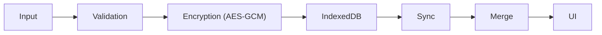

<!-- markdownlint-disable MD004 MD005 MD007 MD009 MD012 MD013 MD029 MD030 MD031 MD032 MD033 MD036 MD040 MD041 MD047 MD060 -->

<p align="left" style="margin: 0 0 4px 0; line-height: 0;">
  <a href="README.md" style="text-decoration: none; border: 0;"></a>&nbsp;
  <a href="#en" style="text-decoration: none; border: 0;"></a>&nbsp;
  <a href="README.es.md" style="text-decoration: none; border: 0;"></a>
</p>

<div align="center" style="margin-top: 0; font-size: 0; line-height: 0;">
  <a href="https://askesis.vercel.app/" target="_blank" rel="noopener noreferrer" style="display: block; text-decoration: none; border: 0;">
    
  </a>
  
</div>

<a id="en" style="text-decoration: none; color: black; font-size: 1.5em; cursor: default;"><b>EN</b></a>

<div align="center">
  
</div>

<br>

Project epigraph — directly connects with Askesis's purpose as a **habit tracker**: consistency and excellence are built through daily practice, and **habits** are the core mechanism that helps train and track them.<br>

<br>

<table>
<tr>
<td>
<b>TABLE OF CONTENTS</b>
  
- [Project Vision](#en-project-vision)
- [Generative AI as Code and Prototyping Assistant](#en-ai-assistant)
- [Usage Guide (Step by Step)](#en-usage-guide)
- [Main User Flows](#en-user-flows)
- [Universal Platform and Sustainability](#en-platform)
- [Architecture](#en-architecture)
  - General Architecture and User Flow
  - General Integrations and Infrastructure
  - General Data Cycle
  - Detailed Diagrams
- [Deep Dive Technical](#en-deep-dive-technical)
  - Data Structure: The Magic Behind
  - Privacy & Cryptography: Technical Details
  - Tests, Validation and Quality
  - Vercel (Bandwidth/Edge Functions)
- [Debugging and Monitoring](#en-debugging)
- [FAQ & Troubleshooting](#en-faq)
- [Roadmap: The Future](#en-roadmap)
- [Who Wants to Contribute](#en-contribute)

</td>
<td align="center" valign="middle">
  
</td>
</tr>
</table><br>

<a id="en-project-vision"></a>
<a id="en-summary"></a>

<h1>Project Vision</h1>

Habit tracker focused on Stoicism, with AI for reflections and adjustments in quotes.

<b>THE MOTIVATION: WHY BUILD IT?</b>

Real data privacy and the ability to generate code and create complete applications using Generative AI (Gen AI):

1. **Sovereign and Data Privacy:** Absolute guarantee that information would not be shared, sold, or analyzed by third parties.

2. **Available Technology:** In an era dominated by subscription models (SaaS), I refused to pay for software that could be built even better with Gen AI help.

My goal: <b>Privacy by design + cryptography + collective anonymity</b>

In Askesis, data belongs exclusively to the user and resides on their device (or their personal encrypted vault). Additionally, in the AI case, a known practice called **collective anonymity** (*anonymity set*) is adopted; since the app does not require identification, use and data are **diluted in the set of users**.

<b>THE PHILOSOPHY: WHAT IS ASKESIS?</b>

**Askesis** (from Greek *ἄσκησις*) is the root of the word "asceticism", but its original meaning is much more practical: it means **"training"** or **"exercise"**.

In Stoic philosophy, *askesis* is not about senseless suffering or deprivation, but the **rigorous and athletic training of the mind and character**. Just as an athlete trains the body for competition, the Stoic trains the mind to deal with life's adversities with virtue and tranquility.

Most habit apps focus on superficial gamification or "not breaking the chain". Askesis focuses on the **virtue of consistency**. It uses Artificial Intelligence to act as a "Stoic Sage", analyzing your data not to judge, but to offer advice on how to strengthen your will.

<br>
<a id="en-ai-assistant"></a>
<h1>Gen AI as Code and Prototyping Assistant</h1>

Askesis was not just "coded"; it was **orchestrated** with Gen AI as a partner. I used Google AI Studio for initial concept prototyping and GitHub Copilot in VS Code (via Codespaces) to refine the code in real time.

- **Human role:** define vision, architecture and priorities; validate what was generated via prompt iteration and testing.
- **AI role:** accelerate heavy implementation, suggest performance adjustments and help eliminate logical bugs.

<a id="en-build-paradigm"></a>
The result is an application that one person can take to a level of complexity and polish more common in a 3-5 dev team.

<b>BUILD PARADIGM: HUMAN-AI ORCHESTRATION</b>

This table explicits where Gen AI offers fast implementation and where my value intervention increments the technical result and gives innovation a step.

---

| Feature | Traditional / Pure AI | My intervention (architect) | Result: Askesis |
|---|---|---|---|
| Privacy | Mandatory login and data in commercial cloud. | Local-first by default; opt-in sync; E2E with AES-GCM on client (in Web Worker) and no PII collection. | Data stays on device; only ciphertext travels on network/server persists. |
| Performance  | Heavy frameworks and costly re-renders that add latency. | Vanilla TypeScript + native APIs; bitmask-first/split-state; workers for CPU-bound tasks; budgets covered by scenario tests. | Verified budgets (ex.: massive reads in < 50ms in tests) and responsive UI. |
| UX & Psychology | Noisy gamification (streaks, dopamine, competition) as standard. | Product directive: reinforce the "virtue of consistency" with minimalist UX and feedback oriented to self-reflection. | Less noise, more adherence: the app serves mental training, not dependency. |
| Accessibility | A11y treated as detail or post-facto. | HTML semantics + ARIA, keyboard navigation and focus management; continuous validation via scenario accessibility tests. | Inclusive and navigable experience without mouse, with practical screen reader support. |
| Reliability | Isolated unit tests or low coverage of real failures. | "Super-tests" suite (journey, sync conflicts, performance, accessibility, security and disaster recovery). | Regressions detected early and resilient behavior under stress. |
| Sustainability | Stateful backend, recurring costs and pressure for subscriptions/ads. | Local-first architecture; serverless only as optional bridge; heavy processing on user's device. | Lean infrastructure and low marginal cost to scale, without aggressive monetization. |
| Efficiency | Bloated apps with large bundles and high battery/CPU consumption. | LED-friendly color optimization, workers for CPU offload and FPS improvement; local-first communication to reduce transfers; load tests and data budgets. | Fast load times (< 2s initial), light bundles (< 60KB gzipped) and low energy impact, prioritizing mobile devices. |

<br>

<a id="en-usage-guide"></a>
<h1>Usage Guide (Step by Step)</h1>

<br>
<p align="center">
  
</p>

Askesis is designed in layers: intuitive on the surface, but packed with powerful tools for those who want depth.

<b>THE FOUNDATION: ADDING HABITS</b>

Habits are the fundamental unit of the application. The system allows tracking not only completion ("check"), but also quantity and intensity (pages read, minutes meditated).

To start building your routine, you have two paths:

- **Bright Green (+) Button:** The main entry point in the bottom corner.

<br>
<p align="center">
  
</p>

- **The "Placeholder" (Card Space):** If a time-of-day period (Morning/Afternoon/Evening) is empty, you’ll see an inviting area ("Add a habit") that allows quick creation directly in the temporal context.

<br>
<p align="center">
  </p>

Once created, your habits can be explored and managed in detail:

- **Habits List:** Explore a list of pre-defined habits (like meditation, reading, exercise) or create your own custom ones. Here, you can manage active and paused habits as needed.

<br>
<p align="center">  
</p>

- **Habit Modal:** You can edit the default goal, adjust the time of day and more.

<br>
<p align="center">  
</p>

- **Icon and Color Change Modal:** Within the habit modal, there is a section dedicated to visual customization. Choose from a variety of representative icons (like books for reading or weights for exercise) and colors that reflect your personal style, making the interface more intuitive and motivating.

<br>
  <div style="text-align: center;">
    
    
  </div>

<br>
<b>TIME AND RINGS (THE CALENDAR)</b>

<br>

If habits are the foundation, **Time** is what gives everything meaning. The top calendar strip is not just decorative; it’s your progress compass.

Days are represented by **Conical Progress Rings**, a data visualization that fills the ring with blue (done) and white (deferred), showing the exact composition of your day with a single glance.

<br>
<p align="center">
  
</p>

**Calendar Micro-Actions (Power User):**
The calendar strip has hidden shortcuts to facilitate bulk management:

- **1 Click:** Select the date to view history.
- **Press and Hold (Long Press):** Open a quick actions menu to **Complete the Day**, **Defer the Day**, or open the **Full Monthly Calendar**, allowing you to jump to any date in the year quickly.

<br>
<p align="center">
  
</p>

<b>THE HABIT CARD: DAILY INTERACTION</b>

The card is the visual representation of your daily duty. It responds to different types of interaction:

- **Clicks (Status):**
  - **1 Click:** Mark as ✅ **Done**.
  - **2 Clicks:** Mark as ➡️ **Deferred** (passes to the next state).
  - **3 Clicks:** Return to ⚪️ **Pending**.
- **Swipe (Swipe - Additional Options):**
  - When swiping the card sideways, you reveal contextual tools:
  - **Create Note:** Add a Stoic observation about the execution of that habit on the day.
  - **Delete:** Allows removing the habit. The system will ask for confirmation to ensure a thoughtful action.
- **Drag (Drag & Drop - Reorganization):**
  - Press and hold the card to initiate dragging.
  - Move the habit between Morning, Afternoon and Evening to adjust your routine.
  - Drop in the new time block to save the new position.

<br>
<div style="display: flex; justify-content: center; gap: 10px;">
    
  
</div>

<b>STOIC ADVICE AND ANALYSIS (AI)</b>

- **AI Button (icon at the top):** Opens the contextual Stoic advice flow.
  - **Period Analysis:** You can request monthly, quarterly or historical reading to receive diagnosis and next practical action.
  - **Offline Mode:** If you're without internet, the app displays a fallback with a Stoic quote to keep the experience useful.

<br>
  <p align="center">
  
  </p>

- **Stoic Quotes:** Right below the calendar, you’ll find reflections from Marcus Aurelius and other Stoics. Click on the quote to read it in full.

<br>
  <p align="center">
  
  </p>

<b>EVOLUTION GRAPH</b>

- **Trend Panel:** Shows the recent behavior of habits and the direction of your consistency.
- **Quick Reading:** Use the graph to identify drop, stability or improvement and adjust goals based on evidence.
- **Rings Complement:** The rings show the day; the graph shows the pattern over time.

<br>
  <p align="center">
  
  </p>

<b>NAVIGATION</b>

- **"Today":** When navigating the past or future, the title "Today" (or the date) at the top acts as an immediate return button to the present.

  <br>
  <div style="text-align: center;">
    
    
    
  </div>
  <br>

<b>THE GEAR: SETTINGS AND RECOVERY</b>

The gear icon in the top corner allows configuration and management of the entire system:

<br>
<p align="center">
  
</p>

- **Language:** Change between Portuguese, English and Spanish directly in the rotary selector.
- **Notifications:** Activate or deactivate reminders and see the current permission status in the panel itself.
- **Cloud Synchronization (Profile Recovery):**
  - Activate synchronization by generating a new key.
  - Insert an existing key to recover data on another device.
  - View/copy your key when sync is already active.
  - Deactivate synchronization when you want to operate only locally.
- **Data & Privacy:**
  - **Export Backup** to save a snapshot of your data.
  - **Restore Backup** to import a valid Askesis file.
- **Reset:** Option to delete all local data with security confirmation.
- **Manage Habits:** Complete list of habits, being able to pause when closing or delete habits and their history.

<br>
  <p align="center">
  
  </p>

<br>
<a id="en-user-flows"></a>
<details>
<summary><h1 style="display:inline; margin:0;">Main User Flows</h1><span style="display:inline; font-family:ui-monospace, SFMono-Regular, Menlo, Consolas, monospace; font-size:0.85em; opacity:0.85;">&nbsp;&nbsp;(click to expand)</span>
</summary>

<br>

<b>FLOW 1: NEW USER (ONBOARDING)</b><br>

```
1. Access askesis.vercel.app
   ↓
2. App initializes (Local-first)
   ↓
3. loadState() tries to load state from IndexedDB
   ↓
4. If there is sync key: fetchStateFromCloud() runs on boot
   ↓
5. User clicks "+"
   ↓
6. "Explore Habits" modal opens
   ↓
7. Chooses a template (or "Create custom")
   ↓
8. Edit modal opens (name, times, frequency and goal)
   ↓
9. Saves → saveHabitFromModal() creates/updates habit
   ↓
10. _notifyChanges() → saveState() (debounced) + render
   ↓
11. If sync active: syncStateWithCloud() schedules sending
   ↓
12. User can continue offline (PWA + IndexedDB) ✅
```

<b>FLOW 2: STATUS MARKING (MULTIPLE CLICKS)</b><br>

```
Initial State: ⚪ PENDING

User clicks 1x
   ↓ toggleHabitStatus()
  ↓ HabitService.setStatus(..., HABIT_STATE.DONE)
  ↓ _checkStreakMilestones() (when applicable)
  ↓ triggerHaptic('light')
  ↓ _notifyPartialUIRefresh() → saveState() debounced + updateDayVisuals()
State: ✅ DONE

User clicks 2x
   ↓ toggleHabitStatus()
  ↓ HabitService.setStatus(..., HABIT_STATE.DEFERRED)
  ↓ triggerHaptic('medium')
  ↓ _notifyPartialUIRefresh()
State: ➡️ DEFERRED

User clicks 3x
   ↓ toggleHabitStatus()
  ↓ HabitService.setStatus(..., HABIT_STATE.NULL)
  ↓ Tombstone bit is written in binary log (9-bit)
  ↓ triggerHaptic('selection')
  ↓ _notifyPartialUIRefresh()
State: ⚪ PENDING (status cleaned via tombstone)
```

<b>FLOW 3: MULTI-DEVICE SYNCHRONIZATION</b><br>

```
1. Local change happens (toggle/edit/import)
  ↓
2. saveState() persists in IndexedDB
  ↓
3. registerSyncHandler(...) calls syncStateWithCloud(snapshot)
  ↓
4. syncStateWithCloud() defines pendingSyncState + debounce
  ↓
5. performSync() sends only altered shards to POST /api/sync
  ↓
6. If conflict (409): resolveConflictWithServerState()
  ↓
7. mergeStates(local, remote) + persistStateLocally() + loadState()
  ↓
8. renderApp() updates UI with consolidated state
  ↓
9. On transient failures/offline: state stays pending and retries

Final Result:
✅ Local-first strategy preserves offline use
✅ Eventual synchronization upon reconnection
✅ Conflict merge without blindly overwriting local state
```

<b>FLOW 4: AI ANALYSIS (DAILY DIAGNOSIS)</b><br>

```
1. renderStoicQuote() runs for selected date
  ↓
2. If no diagnosis exists on day: emitRequestAnalysis(date)
  ↓
3. listeners.ts receives APP_EVENTS.requestAnalysis
  ↓
4. checkAndAnalyzeDayContext(date) processes day's notes
  ↓
5. Guardrails: no notes, offline, insufficient history or recent analysis → aborts
  ↓
6. Worker builds prompt (build-quote-analysis-prompt)
  ↓
7. POST /api/analyze with prompt + systemInstruction
  ↓
8. Valid response saved:
  state.dailyDiagnoses[date] = { level, themes, timestamp }
  ↓
9. saveState() persists and adapted quote uses returned level
```

<b>FLOW 5: MILESTONE CELEBRATIONS (21 & 66 DAYS)</b><br>

```
1. User marks habit as DONE
  ↓ toggleHabitStatus()
2. _checkStreakMilestones(habit, date)
  ↓
3. calculateHabitStreak(...) calculates current streak
  ↓
4. If streak == 21: adds to pending21DayHabitIds
  ↓
5. If streak == 66: adds to pendingConsolidationHabitIds
  ↓
6. renderAINotificationState() lights indicator in AI button
  ↓
7. When opening AI: consumeAndFormatCelebrations() mounts message
  ↓
8. IDs move to notificationsShown and pending lists are cleared

Result:
✅ Celebrations displayed in-app
✅ Same milestone not duplicated for same habit
✅ Persistence of celebration history after saveState()
```

</details>

<br>
<a id="en-platform"></a>
<h1>Universal Platform and Sustainability</h1>

Askesis was built with the premise that technology should adapt to the user, not the other way around.

<b style="display:inline; margin:0; padding:0; border:0;">UNIVERSAL EXPERIENCE (PWA)</b><br>

Askesis is a **Progressive Web App (PWA)** of the latest generation. This means it combines the ubiquity of the web with the performance of native applications.

- **Installable:** Add to the home screen of iOS, Android, Windows or Mac. It behaves like a native app, removing the browser bar and integrating with the operating system.
- **Offline-First:** Thanks to an advanced Service Workers strategy, the app loads instantly and is **totally functional without internet**. You can mark habits, view charts and edit notes on a flight or subway.
- **Native Feel:** Implementation of haptic feedback (Haptics) in micro-interactions, fluid swipe gestures and 60fps animations guarantee a tactile and responsive experience.

<b style="display:inline; margin:0; padding:0; border:0;">INCLUSION (A11Y) AND LOCALIZATION</b><br>

Stoic discipline is for everyone. Askesis's code follows rigorous accessibility standards (WCAG) to ensure that people with different needs can fully use the tool.

- **Robust Semantics:** Correct use of semantic HTML elements and ARIA attributes (`aria-label`, `role`, `aria-live`) to ensure that **Screen Readers** correctly interpret the interface.
- **Keyboard Navigation:** The entire app is navigable without a mouse. Modals have "Focus Traps" to prevent focus from getting lost, and shortcuts (like `Enter` and `Space`) work in all interactive elements.
- **User Respect:** The app detects and respects the system's preference for **Reduced Motion** (`prefers-reduced-motion`), disabling complex animations to avoid vestibular discomfort.
- **Legibility:** Color contrast calculated dynamically to ensure legibility in any theme chosen by the user.

**MULTI-LANGUAGE SUPPORT (I18N)**

Askesis natively supports 3 languages with intelligent fallback:

```typescript
LANGUAGES = {
  'pt': 'Português (Brasil)',
  'en': 'English',
  'es': 'Español'
}

// Translation system:
// 1. Search key in preferred language
// 2. If not exists, fallback to 'en' (default)
// 3. If not in 'en' either, return key as fallback
```

**Translation Key Examples:**

```
aiPromptQuote       → Prompt for quote analysis
aiSystemInstruction → Stoic Sage Instructions
aiCelebration21Day  → 21-day celebration
aiCelebration66Day  → 66-day celebration
habitNameCheckin    → "Check-in"
timeOfDayMorning    → "Morning"
streakCount         → "{count} days in a row"
```

**Intelligent Locales:**

```typescript
// Date formatting by language:
pt-BR: "15 de janeiro de 2025"
en-US: "January 15, 2025"
es-ES: "15 de enero de 2025"

// Numbers and percentages respect locale
pt-BR: "1.234,56" (comma as decimal)
en-US: "1,234.56" (dot as decimal)
es-ES: "1.234,56" (same as PT)
```

<b>ZERO COST ARCHITECTURE & SUSTAINABILITY</b><br>

This project was designed with intelligent engineering to operate with **Zero Cost ($0)**, leveraging free modern services without losing quality.<br>

- **Ultra-Light Storage (GZIP):** Historical data ("Cold Storage") is compressed via GZIP Stream API before being saved or sent to the cloud. This drastically reduces bandwidth and storage usage.
- **The Phone Works:** Most of the "thinking" (cryptography, chart generation, calculations) is done by your own device, not the server. This saves cloud resources, ensuring we never exceed free limits.
- **Free Notifications:** We use OneSignal's community plan, which allows up to 10,000 web users for free.

<b>CAPACITY ESTIMATES (BASED ON FREE LIMITS)</b><br>

Considering the three platforms simultaneously (Gemini, Vercel and OneSignal), the app's practical limit is given by the **lowest ceiling** among them:

- **Gemini Flash:** ~**500 users/day** (1,000 req/day ÷ 2 req/user/day)
- **Vercel (100 GB/month):** ~**1,780 users/month** (≈ 57.5 MB/user/month)
- **OneSignal:** **10,000 users** (limit per subscribers)

**Conclusion:** the current bottleneck is **Gemini Flash (≈ 500 users/day)**. Even though Vercel and OneSignal support more, AI is the limiter before depending on community collaboration or infrastructure adjustments.

<a id="en-highlights"></a><br>
<a id="en-architecture"></a>
<h1>Architecture</h1>

<a id="en-architecture-user-flow"></a>
<b>GENERAL ARCHITECTURE AND USER FLOW</b><br>

<p align="center">
  
</p>

<span style="font-size: 0.8em;">This diagram illustrates the main application lifecycle, structured in three fundamental phases:

- Phase 1: Definition (Onboarding): Habit creation and customization with absolute focus on privacy, using a Local-first approach with End-to-End encryption (E2E).
- Phase 2: Execution (Engagement): Daily management, performance metrics and data persistence. The interface (Main Thread) is isolated from data processing (Worker), using IndexedDB for local storage and CRDT-lite protocol for conflict-free cloud synchronization (Vercel KV).
- Phase 3: Intelligence (Feedback): An analysis engine evaluates user data to generate personalized behavioral insights, injecting this context back into the experience to create a continuous engagement loop.</span>

<a id="en-integrations-infra"></a>
<b>GENERAL INTEGRATIONS AND INFRASTRUCTURE</b><br>

<p align="center">
  
</p>

<span style="font-size: 0.8em;">This diagram details the high-level system architecture and communication flow between external services:

- Client (Askesis PWA): The React-based interface handling daily user interactions, local state management and request initiations.
- Serverless Backend (Vercel API): Acts as a secure intermediary layer. It manages state synchronization and serves as an "AI Proxy," protecting API keys and validating requests before routing them to the language model.
- AI Engine (Google Gemini API): The analytical brain behind the app, receiving filtered data from the backend to process reflections and generate personalized insights.
- Notifications (OneSignal): Independent messaging service that registers the PWA and handles asynchronous push notification delivery to re-engage the user back into the app.</span>

<a id="en-data-lifecycle"></a>
<b>GENERAL DATA CYCLE</b><br>



<a id="en-c4-l3"></a>
<b>DETAILED DIAGRAMS</b>

<b>Internal Architecture</b>

Layered architecture: Presentation (UI), Domain (logic/state), Infrastructure (persistence/sync). Details in [docs/ARCHITECTURE.md#componentes-internos](docs/ARCHITECTURE.md#componentes-internos).

<b> Data Flow</b>

Local-first model: saving in IndexedDB, incremental encrypted sync (shards via Web Worker, merge with LWW/deduplication). Diagram in [docs/ARCHITECTURE.md#fluxo-dados](docs/ARCHITECTURE.md#fluxo-dados).

<b>Sync Conflict Flow</b>

Conflicts: remote decryption, merge with LWW/deduplication, persistence and retry. Diagram in [docs/ARCHITECTURE.md#fluxo-conflicto](docs/ARCHITECTURE.md#fluxo-conflicto).

<br>
<a id="en-deep-dive-technical"></a>
<details>
<summary><h1 style="display:inline; margin:0;">Deep Dive Technical</h1><span style="display:inline; font-family:ui-monospace, SFMono-Regular, Menlo, Consolas, monospace; font-size:0.85em; opacity:0.85;">&nbsp;&nbsp;(click to expand)</span>
</summary>

<br>

<b>FILE STRUCTURE</b><br>

```text
.
├── api/                 # Vercel Edge Functions (Serverless Backend)
├── assets/              # Images/flags/diagrams used in app/README
├── css/                 # Modular CSS (layout, components, etc.)
├── data/                # Static data (quotes, pre-defined habits)
├── icons/               # Icons (SVG) and related assets
├── locales/             # Translation Files (i18n)
├── render/              # Rendering Engine (DOM Recycling & Templates)
├── listeners/           # Event & Gesture Controllers
├── services/            # Data Layer, Cryptography and IO
│   ├── api.ts           # HTTP client
│   ├── cloud.ts         # Sync Orchestrator + Worker Bridge
│   ├── crypto.ts        # Isomorphic AES-GCM Cryptography
│   ├── dataMerge.ts     # Public merge/dedup barrel
│   ├── dataMerge/       # Modular merge core (CRDT-lite)
│   ├── habitActions.ts  # Public habit actions barrel
│   ├── habitActions/    # Modular business logic core
│   ├── migration.ts     # Schema/bitmasks migrations
│   ├── persistence.ts   # Async IndexedDB Wrapper
│   ├── quoteEngine.ts   # Quote selection engine
│   ├── selectors.ts     # Optimized read layer (memoized)
│   └── sync.worker.ts   # Web Worker for CPU-bound tasks
├── tests/               # Scenario tests (resilience, performance, security)
├── state.ts             # Global state (Single Source of Truth)
├── render.ts            # Render facade/orchestrator (re-export)
├── listeners.ts         # Listeners setup (bootstrap)
├── index.tsx            # Entry point
├── index.html           # App Shell (Critical Render Path)
└── sw.js                # Service Worker (Atomic Caching)
```

<a id="en-project-structure"></a>
<b>PROJECT STRUCTURE</b><br>

- Serverless backend: [api/](api/)
- Rendering: [render/](render/)
- Gestures and events: [listeners/](listeners/)
- Data and cryptography: [services/](services/)

<a id="en-modules-map"></a>

**QUICK MODULE MAP (FOLDER → RESPONSIBILITY)**

- render/: visual composition, DOM diffs, modals, calendar and charts.
- listeners/: UI events (cards, modal, swipe/drag, calendar, sync).
- services/: domain + infrastructure (habitActions/*, selectors, persistence, cloud, dataMerge/*, analysis, quoteEngine, HabitService).
- api/: serverless edge endpoints (/api/sync, /api/analyze) with rate-limit, CORS and hardening.
- state.ts: canonical state model, types and caches.
- services/sync.worker.ts: AES-GCM crypto and AI prompt building off the main thread.
- tests/ and services/*.test.ts: journey scenarios, security, resilience, merge and regression.

**MAIN TECHNICAL ASPECTS**

Askesis operates in the "Sweet Spot" of web performance, using modern native APIs to surpass frameworks:

---

| Aspect | Description | Benefit |
|---------|-------------|-----------|
| **"Bitmask-First" Data Architecture** | Habit state in bitmaps (`BigInt`) for O(1) checks and minimal memory. | Instant history queries without performance impact, even with years of data. |
| **"Split-State" Persistence** | IndexedDB separates hot/cold data for instant app startup. | App opens in seconds, without unnecessary parsing of old data. |
| **UI Physics with Advanced APIs** | Fluid interactions via Houdini and `scheduler.postTask` for non-blocking UI. | Smooth animations and responsive, improving user experience on any device. |
| **Multithreading (Web Workers)** | Heavy tasks (crypto, parsing, AI) isolated in workers for Jank-free UI. | Interface always fluid, without freezes during intensive operations. |
| **Zero-Copy Encryption** | AES-GCM off-main-thread with direct `ArrayBuffer`, efficient on modest devices. | Maximum security without sacrificing speed, even on basic phones. |
| **Smart Synchronization (CRDT-lite)** | Conflict resolution with semantic weights, progress always preserved. | Reliable sync between devices, without data loss or manual conflicts. |

<a id="en-tech"></a>

<b>TECHNOLOGY</b><br>

- Pure TypeScript, no heavy frameworks.
- PWA with Service Worker and atomic caching.
- AES-GCM encryption and resilient sync.
- Efficient rendering and 60fps UX.

**QUICK FLOW MAP**

| Flow | Input | Output |
|---|---|---|
| Daily status | Tap on card | Bitmask + immediate render |
| Privacy | Local data | AES-GCM in worker |
| Offline-first | Service Worker | Atomic cache |
| Synchronization | Sync key | Resilient merge |

<b style="display:inline; margin:0; padding:0; border:0;">DATA STRUCTURE: THE MAGIC BEHIND</b>

Askesis uses highly optimized data structures that are rarely seen in web applications. Understanding this choice is understanding why the app is so fast:

<br>

**🔢 THE 9-BIT BITMASK SYSTEM**

Each habit is stored in compressed form using **BigInt** (JavaScript's arbitrarily large integers).

```
Each day occupies 9 bits (for 3 periods: Morning, Afternoon, Evening):

┌───────────────────────────────────────────────────────────────────────────────────────────────┐
│ Day = [Tombstone(1 bit) | Evening Status(2) | Afternoon Status(2) | Morning Status(2) | Reserved(2) ] │
└───────────────────────────────────────────────────────────────────────────────────────────────┘

Possible states (2 bits each):
  00 = Pending (not started)
  01 = Done (completed)
  10 = Deferred (deferred/snoozed)
  11 = Reserved for future expansion

Example of 1 month (30 days):
  - Without compression:   30 days × 3 periods × 8 bytes = 720 bytes
  - With bitmask:      30 days × 9 bits = 270 bits ≈ 34 bytes (21x smaller!)
  - GZIP:             34 bytes → ~8 bytes compressed
```

**Bitwise Operations O(1):**

```typescript
// Read habit status at 2025-01-15 in Morning:
const status = (log >> ((15-1)*9 + PERIOD_OFFSET['Morning'])) & 3n;

// Write status:
log = (log & clearMask) | (newStatus << bitPos);

// This is **instantaneous** even with 10+ years of data!
```

**📦 SPLIT-STATE STORAGE: JSON + BINARY**

Askesis's IndexedDB stores data in **two separate columns**:

```
┌──────────────────────────────────────────┐
│ IndexedDB (AskesisDB)                    │
├──────────────────────────────────────────┤
│ KEY: "askesis_core_json"                 │
│ VALUE: {                                 │
│   version: 9,                            │
│   habits: [Habit[], ...],                │
│   dailyData: Record<>,                   │
│   ... (everything except monthlyLogs)    │
│ }                                        │
│ SIZE: ~50-200 KB (even with 5 years)     │
├──────────────────────────────────────────┤
│ KEY: "askesis_logs_binary"               │
│ VALUE: {                                 │
│   "habit-1_2024-01": "a3f4e8c...",       │ ← Hex string (9-bit logs)
│   "habit-1_2024-02": "b2e5d1a...",       │
│   ...                                    │
│ }                                        │
│ SIZE: ~8-15 KB (even with 5 years)       │
└──────────────────────────────────────────┘
```

**Benefits:**

- **Instant startup:** JSON loads in < 50ms, binaries on demand
- **Efficient backup:** Export data = only JSON (< 200 KB)
- **Safe migration:** Old versions + new coexist without conflicts

**🔗 TOMBSTONE PATTERN: SOFT DELETE WITH SYNC SAFETY**

When you delete a habit, Askesis **does not erase it**. Instead, it marks with a "Tombstone" (grave):

```
┌───────────────────────────────────────┐
│ DELETE HABIT 'Meditate'               │
├───────────────────────────────────────┤
│ 1. Instead of: habits.remove(id)     │
│    Does:         habit.deletedOn = now │
│                                       │
│ 2. Marks in bitmask:                  │
│    Bit 8 (Tombstone) = 1              │
│    (Forces all bits to 0)             │
│                                       │
│ 3. Benefit:                           │
│    - If sync didn't reach another app,│
│      it receives DELETE + Syncs       │
│    - History preserved for backup     │
│    - Undo possible (re-activate)      │
└───────────────────────────────────────┘
```

**Example real:**

```typescript
// User deletes 'Meditate' on 2025-02-01
habitActions.requestHabitPermanentDeletion('habit-123');

// In bitmask, 2025-02-01 becomes:
// 100 | 00 | 00 | 00 | 00 = 4 (Tombstone active)

// When syncing with another device:
// 1. Server receives tombstone bit
// 2. Propagates DELETE to all clients
// 3. Previous history preserved in archives/
```

**🧬 CRDT-LITE: CONFLICT RESOLUTION WITHOUT SERVER**

When two devices sync with conflicting changes, Askesis resolves automatically **without needing an authority server**:

```
┌─── Device A (Offline for 2 days) ──────┐
│ 2025-01-15 Morning: DONE               │
│ 2025-01-16 Afternoon: DEFERRED         │
└────────────────────────────────────────┘
                ↓ Reconnects
┌─── Cloud State ────────────────────────┐
│ 2025-01-15 Morning: DEFERRED (Device B)│
│ 2025-01-16 Afternoon: PENDING (Device B)│ 
└────────────────────────────────────────┘
                ↓ Merge (CRDT)
┌─── Result (Convergence) ────────────────┐
│ 2025-01-15 Morning: DONE ✅            │
│   (Reason: DONE > DEFERRED = stronger) │
│ 2025-01-16 Afternoon: DEFERRED         │
│   (Reason: DEFERRED > PENDING = closer │
│    to completion)                      │
└────────────────────────────────────────┘
```

**Semantics of resolution:**

```
State precedence:
DONE (01) > DEFERRED (10) > PENDING (00)

Logic: max(a, b) between the two 2-bit values
```

This ensures the user **never loses progress** when syncing.

<b style="display:inline; margin:0; padding:0; border:0;">PRIVACY & CRYPTOGRAPHY: TECHNICAL DETAILS</b>

<br>

Askesis implements end-to-end encryption so that **the server never knows your data**:
<br>

**🔐 AES-GCM ENCRYPTION FLOW (256-BIT)**

```
┌─ User Data (Plaintext) ───┐
│ {                        │
│   habits: [...],         │
│   dailyData: {...},      │
│   monthlyLogs: Map<>     │
│ }                        │
└───────────────────────────┘
         ↓ JSON.stringify()
┌─ Serialization ──────────┐
│ "{\"habits\":[...], ...}"│
└───────────────────────────┘
         ↓ Generates random SALT + IV
┌─ Key Derivation (PBKDF2) ─┐
│ Password: "user_sync_key" │
│ Salt: 16 bytes random     │
│ Iterations: 100.000 (security)│
│ Output: 256-bit key      │
└───────────────────────────┘
         ↓ AES-GCM.encrypt()
┌─ Ciphertext (Ciphertext) ─┐
│ SALT (16 bytes) +         │
│ IV (12 bytes) +           │
│ ENCRYPTED_DATA (N bytes) +│
│ AUTH_TAG (16 bytes)       │
│                           │
│ Total: 44 + N bytes       │
└───────────────────────────┘
         ↓ Base64
┌─ Transport (URL Safe) ────┐
│ "AgX9kE2...F3k=" ← Base64 │
│ Sent to POST /api/sync    │
└───────────────────────────┘
         ↓ On Server
┌─ Server (No Knowledge) ─────┐
│ Receives only B64 string    │
│ Stores as is                │
│ No decryption capability    │
│ (doesn't have user password)│
└─────────────────────────────┘
```

**🔄 MULTI-DEVICE SYNCHRONIZATION**

Each device has its own **independent sync key**:

```
┌─ Device A (Phone) ─────────────┐
│ Sync Key: "abc123def456"      │
│ Encrypts: data with "abc123"  │
└────────────────────────────────┘
                  ↓
          ☁️ Cloud Storage
          (No D.B access)
                  ↓
┌─ Device B (Tablet) ────────────┐
│ Sync Key: "abc123def456"      │
│ (Same user = same key)        │
│ Decrypts: using "abc123"      │
└────────────────────────────────┘
```

**Offline scenario:**

```
Device A (offline) → Local changes → Enqueue
Device A (online)  → POST encrypted data
Server            → Store & merge
Device B (online) → GET encrypted data
Device B          → Decrypt & merge
Device B          → Render updated state
```

<a id="en-tests-quality"></a>
<b style="display:inline; margin:0; padding:0; border:0;">TESTS, VALIDATION AND QUALITY</b>

<br>

Askesis's reliability is validated by a comprehensive suite, focusing on real usage scenarios, security, accessibility, performance and resilience.

- Coverage of user flows, security, accessibility and resilience.
- CI: workflow in `.github/workflows/ci.yml` runs tests/build and uploads artifacts (dist + coverage).
- To avoid divergence between documentation and execution, the operational detailing of the suite (inventory, current counts, daily flow, PR checklist and update convention) is centralized in [tests/README.md](tests/README.md).

Quick summary:

- Full execution: `npm test -- --run`
- Integration scenarios: `npm run test:scenario`
- Coverage: `npm run test:coverage`
- Updated suite details: [tests/README.md](tests/README.md)

> Running your own instance is possible, but reduces collective anonymity.

<a id="en-complete-guide"></a>
<b style="display:inline; margin:0; padding:0; border:0;">VERCEL (BANDWIDTH/EDGE FUNCTIONS)</b><br>

**Production**

```bash
CORS_ALLOWED_ORIGINS=https://askesis.vercel.app
CORS_STRICT=1
ALLOW_LEGACY_SYNC_AUTH=0
AI_QUOTA_COOLDOWN_MS=90000
SYNC_RATE_LIMIT_WINDOW_MS=60000
SYNC_RATE_LIMIT_MAX_REQUESTS=120
ANALYZE_RATE_LIMIT_WINDOW_MS=60000
ANALYZE_RATE_LIMIT_MAX_REQUESTS=20
```

**Preview**

```bash
CORS_ALLOWED_ORIGINS=https://askesis.vercel.app
CORS_STRICT=1
ALLOW_LEGACY_SYNC_AUTH=0
AI_QUOTA_COOLDOWN_MS=90000
SYNC_RATE_LIMIT_WINDOW_MS=60000
SYNC_RATE_LIMIT_MAX_REQUESTS=200
ANALYZE_RATE_LIMIT_WINDOW_MS=60000
ANALYZE_RATE_LIMIT_MAX_REQUESTS=40
```

**Development**

```bash
CORS_ALLOWED_ORIGINS=http://localhost:5173
CORS_STRICT=0
ALLOW_LEGACY_SYNC_AUTH=1
AI_QUOTA_COOLDOWN_MS=30000
DISABLE_RATE_LIMIT=1
```

Note: with `CORS_STRICT=1`, the backend also allows the origin of the current Vercel deploy (production or preview) via forwarded host, maintaining blocking for external origins.

</details>

<br>

<a id="en-debugging"></a>
<h1>Debugging and Monitoring</h1>

Askesis provides native monitoring in the app itself, without depending on DevTools for normal use.

**SYNCHRONIZATION PANEL (SYNC DEBUG MODAL)**

How to open through normal flow:

1. Open **Manage** (gear icon).
2. Enter **Cloud Synchronization**.
3. Touch the sync status indicator (status text) to open the diagnostic modal.

In the modal, you follow the technical history of synchronization in real time, for example:

```
✅ Syncing 3 packages...
✅ Cloud updated.
ℹ️ No news in cloud.
⚠️ Sync server temporarily unavailable. Re-enqueued.
❌ Send failure: Error 401
```

**Why is it useful?**

- Confirm if data arrived in cloud
- Understand if app is in `syncSaving`, `syncSynced`, `syncError` or `syncInitial`
- Identify offline scenarios, automatic retry and conflicts

**Quick reading of states**

```
syncInitial  → Sync disabled / no local key
syncSaving   → Pending changes being sent
syncSynced   → Local and cloud state aligned
syncError    → Non-transient failure (requires attention)
```

**When to act**

- `syncSaving` for little time: expected behavior (debounce + batch sending)
- `syncSaving` for long time: check connection and open diagnostic panel
- `syncError`: review sync key and network status
- “Re-enqueued” messages: transient failure, app will retry automatically
<br>

<br>

<a id="en-roadmap"></a>
<h1>Roadmap: The Future</h1>

The vision for Askesis is to expand its native presence while maintaining the unified code base.

- **Less daily friction:** reduce the gap between intention and execution (habit check-ins in seconds through fast and contextual flows).
  - **Quick Marking (almost without opening the app):** Pure PWAs cannot mark habits 100% in background without user interaction. As a practical alternative, use interactive push actions (OneSignal/FCM) and app shortcuts with `/quick-mark?period=...` to open a minimal view, mark and return quickly.
- **Wider distribution with a code base:** maintain a web-first strategy while expanding reach on Android through TWA/Play Store.
  - **Play Store via Bubblewrap (TWA):** Prepare manifest/splash for Android packaging with `@bubblewrap/cli`, generate APK with `bubblewrap init --manifest=https://askesis.vercel.app/manifest.json`, add native capabilities light (ex.: push via FCM), and validate on Android devices.
- **Greater technological sovereignty:** reduce external dependencies with self-hosted options (local LLM) and low-cost sustainable architecture.
  - **Local LLM Optional (Qwen small):** Self-hosted alternative to Gemini to reduce recurring cost and increase privacy control in compatible environments.

<br>

<a id="en-faq"></a>
<details>
<summary><h1 style="display:inline; margin:0;">FAQ & Troubleshooting</h1><span style="display:inline; font-family:ui-monospace, SFMono-Regular, Menlo, Consolas, monospace; font-size:0.85em; opacity:0.85;">&nbsp;&nbsp;(click to expand)</span></summary>

<br>

**Q: Is my data really private?**

A: Yes. By default, all data is stored locally on your device via IndexedDB. If you opt for sync, end-to-end encryption (AES-GCM) is applied, and **even the server has no access to your sync password**. Only encrypted data travels over the network.

**Q: Can I lose my data if I change phones?**

A: No, if you saved your **Sync Key**. Save this key in a secure place (password manager, protected note). When installing Askesis on a new phone, enter the key and all your data will sync automatically.

**Q: How does sync work if I'm offline?**

A: Changes are queued locally. When you reconnect to the internet, all pendings are synced automatically. No data loss.

**Q: Does AI (Google Gemini) see my data?**

A: No. Gemini receives only:

- Notes you added (totally optional)
- Generalized context (Stoic themes, not personal data)
- It has no access to dates, history or identifiers

**Q: Can I use Askesis on multiple devices?**

A: Yes! Each device uses the same **Sync Key** to keep data in sync. Phone, tablet and desktop can be synced.

**Q: What if I forget my Sync Key?**

A: Unfortunately, you **cannot recover it** (this is by design — ensures even the server doesn't have it). But your local data doesn't get lost. You can:

1. Continue using Askesis on that device only
2. Generate a new key and start a new sync
3. Export data before changing (⚙️ → Export)

**Q: How much space does Askesis use?**

A: Very little. Even with 5 years of history:

- **Main data (JSON):** ~50-200 KB
- **Compressed binary logs:** ~8-15 KB
- **Total:** < 500 KB for most users

**Q: Does the app work fully offline?**

A: Yes, **100%**. You can mark habits, add notes, view charts — everything without internet. AI (Google Gemini) and notifications (OneSignal) require connection, but are optional.

**Q: How do I uninstall Askesis?**

A: If installed as PWA:

- **Android:** Long press the icon → "Uninstall"
- **iOS:** Long press the icon → "Remove App"
- **Desktop:** Control-click (Windows) or Cmd-click (Mac) on the shortcut → "Remove"

Your local data is deleted automatically. If you want to preserve data, export first (⚙️ → Export).

---

**🔧 COMMON TROUBLESHOOTING**

<h4>❌ "Sync not working"</h4>

**Diagnosis:**

1. Check if online (open google.com in new tabs)
2. Open DevTools (F12) → Console
3. Look for red errors

**Solutions:**

```
If you see "[API] Network Error":
  → Firewall or proxy blocking
  → Try on different network (ask friend's WiFi)
  → Open https://askesis-psi.vercel.app in browser (should load)

If you see "[API] Timeout after 5s":
  → Your connection is slow
  → Try on better WiFi place
  → If on phone, try mobile data

If you see "Sync Key invalid":
  → Key was corrupted/typed wrong
  → ⚙️ → Copy Key again
  → Try syncing on another device with same key
```

**If the problem persists:**

1. Open Sync Debug Panel: `openSyncDebugModal()` in console
2. Screenshot the sync history
3. Look for an existing issue in [GitHub](https://github.com/farifran/Askesis/issues)
4. If none, open an issue with the screenshot

<h4>❌ "Data disappeared!"</h4>

**Before panicking:**

1. **Check localStorage not cleared:**

   ```
   F12 → Application → Storage → Local Storage → askesis-psi.vercel.app
   You should see an entry "habitTrackerSyncKey"
   ```

2. **Check IndexedDB:**

   ```
   F12 → Application → Storage → IndexedDB → AskesisDB
   You should see "app_state" and possibly "askesis_logs_binary"
   ```

3. **If empty (was deleted):**
   - Accidental browser cleanup happened
   - Data can only be recovered if you exported before
   - If you had sync, data is in cloud (re-import with key)

4. **If data is there but not showing:**
   - Try Hard Refresh: **Ctrl+Shift+R** (Windows) or **Cmd+Shift+R** (Mac)
   - Clear Service Worker cache:

     ```
     F12 → Application → Service Workers
     Click "Unregister" on each one
     Reload page
     ```

<h4>❌ "Service Worker not registering"</h4>

**Possible causes:**

1. **You are on http:// (not https://)**
   - Service Workers only work on HTTPS or localhost
   - Check if accessing correct URL

2. **Browser blocked Service Worker**
   - Go to browser ⚙️ → Settings → Privacy
   - Look for "Notifications" or "Web Workers"
   - Allow for askesis-psi.vercel.app

3. **Another Service Worker conflicting**

   ```
   F12 → Application → Service Workers
   Unregister all old SWs
   Reload page
   ```

<h4>❌ "Habits appear duplicated in different periods"</h4>

**Solution:**

This happens if you created the same habit 2x or conflicting sync.

1. Go to ⚙️ → Manage Habits
2. Identify the duplicate
3. Click "Delete Permanently"
4. Confirm "Forever"
5. Sync: will delete on server too

<h4>❌ "Performance is slow"</h4>

**Diagnosis:**

1. Open DevTools → Performance tab
2. Click "Record"
3. Mark some habits in app
4. Click "Stop"
5. Analyze flame chart

**Common causes:**

```
If you see spikes in "sync.worker.ts":
  → Cryptography taking time
  → Normal for old data
  → Let it complete, not blocking

If you see rendering > 100ms:
  → Too many habits on screen (100+)
  → Scroll to "virtualize" list
  → Temporary while scroll finishes

If constantly using 100%+ CPU:
  → Something in loop
  → Open `openSyncDebugModal()`
  → Look for continuous errors
  → Clear cache (Ctrl+Shift+R)
```

<h4>❌ "Notifications not working"</h4>

**Check:**

1. ⚙️ → Notifications
2. Click "Allow Notifications"
3. Your browser will ask permission (accept)
4. Try "Send Test"

**If notification doesn't arrive:**

```
Reason 1: Browser denies permission
  → F12 → Application → Manifest
  → See if "notificationsRequested" = false
  → Clear permissions:
     Chrome: ⚙️ → Privacy → Cookies/Sites
     Firefox: ⚙️ → Privacy → Notifications

Reason 2: OneSignal disabled (API debit)
  → Open https://status.onesignal.com
  → Look for "Web Push" status
  → If Red, notifications globally down
  → Wait for status to return

Reason 3: Offline
  → Notifications need internet
  → Connect to network
```

<h4>❌ "Can't install as app (PWA)"</h4>

**By browser:**

**Google Chrome / Edge:**

```
1. Open https://askesis.vercel.app
2. Look for "Install" icon in address bar
3. If not seeing:
   - Check if on HTTPS (should be)
   - Update your browser
   - Try in Incognito (extensions may block)
4. Click "Install"
5. App will appear on Home Screen
```

**Safari (iOS):**

```
1. Open https://askesis.vercel.app
2. Click Share button (bottom right)
3. Scroll to "Add to Home Screen"
4. Confirm with preferred name
5. App will appear as icon on Home Screen
```

**Firefox:**

```
Firefox supports PWA but no obvious visual option:
1. Open page
2. Go to ⚙️ → Applications
3. Look for "Askesis" and click "Install"
Alternative: Leave in "Home" (Firefox only allows PWA via this method)
```

---

**📞 GETTING SUPPORT**

If the troubleshooting above didn't resolve:

1. **Check the GitHub "Issues" section:**
   - Search by error keyword
   - Many solutions may be there

2. **Open a new Issue:**

- [GitHub Issues - Askesis](https://github.com/farifran/Askesis/issues)
- Include:
  - Your browser (Chrome v130, Safari 17.x, etc.)
  - Operating system (Windows, macOS, iOS, Android)
  - Screenshots or videos of error
  - Exact steps to reproduce problem
  - Output from Sync Debug Panel

1. **Contribute Fix:**
   - If you found the cause, consider opening a Pull Request
   - Follow contribution guide in README

---

</details>

<br>

<a id="en-contribute"></a>
<h1>Who Wants to Contribute</h1>

**IN THE PROJECT**

1. **Fork the repository** on GitHub
2. **Create a branch** for your feature:

   ```bash
   git checkout -b feature/my-feature
   ```

3. **Make your changes** and commit:

   ```bash
   git commit -m "feat: add X functionality"
   ```

4. **Run tests locally:**

   ```bash
   npm run test:super
   ```

5. **Push to your branch:**

   ```bash
   git push origin feature/my-feature
   ```

6. **Open a Pull Request** describing your changes

Look for issues marked with `good-first-issue` to start!

**MONETARY SUPPORT**

If Askesis is helping you strengthen your will and consistency, consider supporting development:

- **[GitHub Sponsors](https://github.com/sponsors/tecnocratoshi)** - Recurring patronage with exclusive rewards
- **[Buy Me a Coffee](https://www.buymeacoffee.com/askesis)** - Single contribution
- **[Ko-fi](https://ko-fi.com/askesis)** - Global alternative

**Why it matters?**

Currently, thanks to free platforms (Vercel, Google Gemini, OneSignal), Askesis can serve up to **500 users simultaneously**. Each contribution allows expanding these limits:

- Activate paid Google Gemini APIs → support **+1000 daily analyses**
- Increase sync quotas → support **+5000 users**
- Implement global CDN → reduce latency in distant regions
- Maintain 24/7 infrastructure → ensure reliability

**Support allows Askesis to be a service with fewer restrictions for more people.**

---

**Thank you for believing in a future where technology serves virtue**

---

<br>
