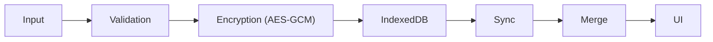

<!-- markdownlint-disable MD004 MD005 MD007 MD009 MD012 MD013 MD029 MD030 MD031 MD032 MD033 MD036 MD040 MD041 MD047 MD060 -->

<p align="left" style="margin: 0 0 4px 0; line-height: 0;">
  <a href="README.md" style="text-decoration: none; border: 0;"></a>&nbsp;
  <a href="README.en.md" style="text-decoration: none; border: 0;"></a>&nbsp;
  <a href="#es" style="text-decoration: none; border: 0;"></a>
</p>

<div align="center" style="margin-top: 0; font-size: 0; line-height: 0;">
  
  
</div>

<a id="es" style="text-decoration: none; color: black; font-size: 1.5em; cursor: default;"><b>ES</b></a>

<div align="center">
  
</div>

Proyecto epígrafe — conecta directamente con el propósito de Askesis como **rastreador de hábitos**: la consistencia y la excelencia se construyen a través de la práctica diaria, y los **hábitos** son el mecanismo central que la aplicación te ayuda a entrenar y rastrear.<br>


<table>
<tr>
<td>
<b>TABLA DE CONTENIDOS</b>
  
- [Visión del Proyecto](#es-project-vision)
- [Asistente de IA para Código y Prototipado](#es-ai-assistant)
- [Guía de Uso (Paso a Paso)](#es-usage-guide)
- [Flujos de Usuario Principales](#es-user-flows)
- [Plataforma Universal y Sostenibilidad](#es-platform)
- [Arquitectura](#es-architecture)
  - Arquitectura General y Flujo de Usuario
  - Integraciones Generales e Infraestructura
  - Ciclo General de Datos
  - Diagramas Detallados
- [Inmersión Técnica Profunda](#es-deep-dive-technical)
  - Estructura de Datos: La Magia Detrás
  - Privacidad y Criptografía: Detalles Técnicos
  - Pruebas, Validación y Calidad
  - Vercel (Ancho de Banda/Funciones de Borde)
- [Depuración y Monitoreo](#es-debugging)
- [Preguntas Frecuentes y Solución de Problemas](#es-faq)
- [Hoja de Ruta: El Futuro](#es-roadmap)
- [Quién Quiere Contribuir](#es-contribute)
</td>
<td align="center" valign="middle">
  
</td>
</tr>
</table><br>

<a id="es-project-vision"></a>
<a id="es-summary"></a>

<h1>Visión del Proyecto</h1>

Rastreador de hábitos enfocado en el Estoicismo, con IA para reflexiones y ajustes en citas.

<b>LA MOTIVACIÓN: ¿POR QUÉ CONSTRUIRLO?</b>

Datos de privacidad reales y la capacidad de generar código y crear aplicaciones completas usando IA Generativa (Gen AI):

1. **Soberanía y Privacidad de Datos:** Garantía absoluta de que la información no sería compartida, vendida o analizada por terceros. 

2. **Tecnología Disponible:** En una era dominada por modelos de suscripción (SaaS), me negué a pagar por software que podría construirse aún mejor con la ayuda de Gen AI.

Mi objetivo: <b>Privacidad por diseño + criptografía + anonimato colectivo</b>

En Askesis, los datos pertenecen exclusivamente al usuario y residen en su dispositivo (o su bóveda personal encriptada). Además, en el caso de la IA, se adopta una práctica conocida llamada **anonimato colectivo** (*conjunto de anonimato*); dado que la aplicación no requiere identificación, el uso y los datos están **diluídos en el conjunto de usuarios**.

<b>LA FILOSOFÍA: ¿QUÉ ES ASKESIS?</b>

**Askesis** (del griego *ἄσκησις*) es la raíz de la palabra "ascetismo", pero su significado original es mucho más práctico: significa **"entrenamiento"** o **"ejercicio"**.

En la filosofía estoica, *askesis* no se trata de sufrimiento insensato o privación, sino del **entrenamiento riguroso y atlético de la mente y el carácter**. Del mismo modo que un atleta entrena el cuerpo para la competición, el estoico entrena la mente para lidiar con las adversidades de la vida con virtud y tranquilidad.

La mayoría de las aplicaciones de hábitos se centran en gamificación superficial o "no romper la cadena". Askesis se centra en la **virtud de la consistencia**. Utiliza Inteligencia Artificial para actuar como un "Sabio Estoico", analizando tus datos no para juzgar, sino para ofrecer consejos sobre cómo fortalecer tu voluntad.

<br>
<a id="es-ai-assistant"></a>
<h1>Asistente de IA para Código y Prototipado</h1>

Askesis no fue solo "codificado"; fue **orquestado** con Gen AI como socio. Usé Google AI Studio para el prototipado inicial de conceptos y GitHub Copilot en VS Code (a través de Codespaces) para refinar el código en tiempo real.

- **Rol humano:** definir visión, arquitectura y prioridades; validar lo que se generó mediante iteración de prompts y pruebas.
- **Rol de IA:** acelerar la implementación pesada, sugerir ajustes de rendimiento y ayudar a eliminar errores lógicos.

<a id="es-build-paradigm"></a>
El resultado es una aplicación que una persona puede llevar a un nivel de complejidad y pulido más común en un equipo de 3-5 desarrolladores.


<b>PARADIGMA DE CONSTRUCCIÓN: ORQUESTACIÓN HUMANO-IA</b>


Esta tabla explicita dónde Gen AI ofrece implementación rápida y dónde mi intervención de arquitecto incrementa el resultado técnico y da innovación un paso.

---

| Característica | Tradicional / IA Pura | Mi intervención (arquitecto) | Resultado: Askesis |
|---|---|---|---|
| Privacidad | Inicio de sesión obligatorio y datos en nube comercial. | Local-first por defecto; sincronización opcional; E2E con AES-GCM en cliente (en Web Worker) y sin recopilación de PII. | Los datos permanecen en el dispositivo; solo ciphertext viaja en red/servidor persiste. |
| Rendimiento  | Marcos pesados y re-renders costosos que añaden latencia. | Vanilla TypeScript + APIs nativas; bitmask-first/split-state; workers para tareas CPU-bound; presupuestos cubiertos por pruebas de escenario. | Presupuestos verificados (ej.: lecturas masivas en < 50ms en pruebas) y UI responsiva. |
| UX y Psicología | Gamificación ruidosa (rayas, dopamina, competencia) como estándar. | Directiva de producto: reforzar la "virtud de la consistencia" con UX minimalista y retroalimentación orientada a la auto-reflexión. | Menos ruido, más adherencia: la aplicación sirve al entrenamiento mental, no a la dependencia. |
| Accesibilidad | A11y tratada como detalle o post-facto. | HTML semántica + ARIA, navegación por teclado y gestión de foco; validación continua mediante pruebas de escenario de accesibilidad. | Inclusiva y navegable experiencia sin mouse, con soporte práctico de lector de pantalla. |
| Fiabilidad | Pruebas unitarias aisladas o cobertura baja de fallos reales. | "Super-pruebas" suite (viaje, conflictos de sincronización, rendimiento, accesibilidad, seguridad y recuperación de desastres). | Regresiones detectadas temprano y comportamiento resiliente bajo estrés. |
| Sostenibilidad | Backend con estado, costos recurrentes y presión para suscripciones/ads. | Arquitectura local-first; servidor sin servidor solo como puente opcional; procesamiento pesado en el dispositivo del usuario. | Lean infraestructura y costo marginal bajo para escalar, sin agresiva monetización. |
| Eficiencia | Aplicaciones infladas con grandes bundles y alto consumo de batería/CPU. | Optimización de color LED-friendly, workers para descarga de CPU y mejora de FPS; comunicación local-first para reducir transferencias; pruebas de carga y presupuestos de datos. | Tiempos de carga rápidos (< 2s inicial), bundles ligeros (< 60KB gzipped) e impacto bajo en energía, priorizando dispositivos móviles. |

<br>

<a id="es-usage-guide"></a>
<h1>Guía de Uso (Paso a Paso)</h1>

<br>
<p align="center">
  
</p>

Askesis está diseñado en capas: intuitivo en la superficie, pero repleto de herramientas poderosas para quienes quieren profundidad.

<b>LA FUNDACIÓN: AGREGAR HÁBITOS</b>

Los hábitos son la unidad fundamental de la aplicación. El sistema permite rastrear no solo la finalización ("check"), sino también cantidad y intensidad (páginas leídas, minutos meditados).

Para comenzar a construir tu rutina, tienes dos caminos:
*   **Botón Verde Brillante (+):** El punto de entrada principal en la esquina inferior.

<br>
<p align="center">
  
</p>

*   **El "Espacio Reservado" (Espacio de Tarjeta):** Si un período de tiempo del día (Mañana/Tarde/Noche) está vacío, verás un área atractiva ("Agregar un hábito") que permite creación rápida directamente en el contexto temporal.

<br>
<p align="center">
  </p>

Una vez creado, tus hábitos pueden explorarse y gestionarse en detalle:

*   **Lista de Hábitos:** Explora una lista de hábitos predefinidos (como meditación, lectura, ejercicio) o crea los tuyos personalizados. Aquí puedes gestionar hábitos activos y pausados según sea necesario.

<br>
<p align="center">  
</p>

*   **Modal de Hábito:** Puedes editar el objetivo predeterminado, ajustar el tiempo del día y más.

<br>
<p align="center">  
</p>

*   **Modal de Cambio de Icono y Color:** Dentro del modal de hábito, hay una sección dedicada a la personalización visual. Elige entre una variedad de iconos representativos (como libros para lectura o pesas para ejercicio) y colores que reflejen tu estilo personal, haciendo la interfaz más intuitiva y motivadora.

<br>
  <div style="text-align: center;">
    
    
  </div>

<br>
<b>TIEMPO Y ANILLOS (EL CALENDARIO)</b>

<br>

Si los hábitos son la fundación, **el Tiempo** es lo que da sentido a todo. La tira de calendario superior no es solo decorativa; es tu brújula de progreso.

Los días se representan por **Anillos de Progreso Cónicos**, una visualización de datos que llena el anillo con azul (hecho) y blanco (diferido), mostrando la composición exacta de tu día con una sola mirada.

<br>
<p align="center">
  
</p>

**Micro-Acciones del Calendario (Usuario Avanzado):**
La tira de calendario tiene atajos ocultos para facilitar la gestión masiva:
*   **1 Clic:** Seleccionar la fecha para ver el historial.
*   **Mantener Presionado (Pulsación Larga):** Abrir un menú de acciones rápidas para **Completar el Día**, **Diferir el Día**, o abrir el **Calendario Mensual Completo**, permitiendo saltar a cualquier fecha en el año rápidamente.

<br>
<p align="center">
  
</p>

<b>LA TARJETA DE HÁBITO: INTERACCIÓN DIARIA</b>

La tarjeta es la representación visual de tu deber diario. Responde a diferentes tipos de interacción:

*   **Clics (Estado):**
    *   **1 Clic:** Marcar como ✅ **Hecho**.
    *   **2 Clics:** Marcar como ➡️ **Diferido** (pasa al siguiente estado).
    *   **3 Clics:** Volver a ⚪️ **Pendiente**.
*   **Deslizar (Deslizar - Opciones Adicionales):**
    *   Al deslizar la tarjeta lateralmente, revelas herramientas contextuales:
    *   **Crear Nota:** Agregar una observación estoica sobre la ejecución de ese hábito en el día.
    *   **Eliminar:** Permite eliminar el hábito. El sistema pedirá confirmación para asegurar una acción reflexiva.
*   **Arrastrar (Arrastrar y Soltar - Reorganización):**
    *   Mantén presionada la tarjeta para iniciar el arrastre.
    *   Mueve el hábito entre Mañana, Tarde y Noche para ajustar tu rutina.
    *   Suelta en el nuevo bloque de tiempo para guardar la nueva posición.

<br>
<div style="display: flex; justify-content: center; gap: 10px;">
    
  
</div>

<b>CONSEJO ESTOICO Y ANÁLISIS (IA)</b>

*   **Botón de IA (icono en la parte superior):** Abre el flujo de consejos estoicos contextuales.
    *   **Análisis de Período:** Puedes solicitar lectura mensual, trimestral o histórica para recibir diagnóstico y próxima acción práctica.
    *   **Modo Offline:** Si estás sin internet, la aplicación muestra un respaldo con una cita estoica para mantener la experiencia útil.

<br>
  <p align="center">
  
  </p>
    
*   **Citas Estoicas:** Justo debajo del calendario, encontrarás reflexiones de Marco Aurelio y otros Estoicos. Haz clic en la cita para leerla en su totalidad.

<br>
  <p align="center">
  
  </p>

<b>GRÁFICO DE EVOLUCIÓN</b>

*   **Panel de Tendencia:** Muestra el comportamiento reciente de los hábitos y la dirección de tu consistencia.
*   **Lectura Rápida:** Usa el gráfico para identificar caídas, estabilidad o mejora y ajustar metas basadas en evidencia.
*   **Complemento de Anillos:** Los anillos muestran el día; el gráfico muestra el patrón a lo largo del tiempo.

<br>
  <p align="center">
  
  </p>

<b>NAVEGACIÓN</b>

*   **"Hoy":** Al navegar por el pasado o futuro, el título "Hoy" (o la fecha) en la parte superior actúa como un botón de retorno inmediato al presente.

  <br>
  <div style="text-align: center;">
    
    
    
  </div>
  <br>

<b>EL ENGRANAJE: CONFIGURACIONES Y RECUPERACIÓN</b>

El icono de engranaje en la esquina superior permite configuración y gestión de todo el sistema:

<br>
<p align="center">
  
</p>

*   **Idioma:** Cambia entre Portugués, Inglés y Español directamente en el selector rotativo.
*   **Notificaciones:** Activa o desactiva recordatorios y ve el estado actual del permiso en el panel mismo.
*   **Sincronización en la Nube (Recuperación de Perfil):**
    *   Activa sincronización generando una nueva clave.
    *   Inserta una clave existente para recuperar datos en otro dispositivo.
    *   Ve/copia tu clave cuando la sincronización ya esté activa.
    *   Desactiva sincronización cuando quieras operar solo localmente.
*   **Datos y Privacidad:**
    *   **Exportar Respaldo** para guardar una instantánea de tus datos.
    *   **Restaurar Respaldo** para importar un archivo válido de Askesis.
*   **Restablecer:** Opción para eliminar todos los datos locales con confirmación de seguridad.
*   **Gestionar Hábitos:** Lista completa de hábitos, siendo capaz de pausar al cerrar o eliminar hábitos y su historia.

<br>
  <p align="center">
  
  </p>


<br>
<a id="es-user-flows"></a>
<details>
<summary><h1 style="display:inline; margin:0;">Flujos de Usuario Principales</h1><span style="display:inline; margin-left:8px; font-size:0.95em; opacity:0.8;">(haz clic para expandir)</span>
</summary>

<br>

<b>FLUJO 1: USUARIO NUEVO (INTEGRACIÓN)</b><br>

```
1. Accede askesis.vercel.app
   ↓
2. La aplicación se inicializa (Local-first)
   ↓
3. loadState() intenta cargar estado desde IndexedDB
   ↓
4. Si hay clave de sincronización: fetchStateFromCloud() se ejecuta al inicio
   ↓
5. El usuario hace clic en "+"
   ↓
6. Se abre el modal "Explorar Hábitos"
   ↓
7. Elige una plantilla (o "Crear personalizado")
   ↓
8. Se abre el modal de edición (nombre, tiempos, frecuencia y objetivo)
   ↓
9. Guarda → saveHabitFromModal() crea/actualiza hábito
   ↓
10. _notifyChanges() → saveState() (debounced) + render
   ↓
11. Si sincronización activa: syncStateWithCloud() programa envío
   ↓
12. El usuario puede continuar offline (PWA + IndexedDB) ✅
```

<b>FLUJO 2: MARCADO DE ESTADO (MÚLTIPLES CLICS)</b><br>

```
Estado Inicial: ⚪ PENDIENTE

Usuario hace clic 1x
   ↓ toggleHabitStatus()
  ↓ HabitService.setStatus(..., HABIT_STATE.DONE)
  ↓ _checkStreakMilestones() (cuando aplicable)
  ↓ triggerHaptic('light')
  ↓ _notifyPartialUIRefresh() → saveState() debounced + updateDayVisuals()
Estado: ✅ HECHO

Usuario hace clic 2x
   ↓ toggleHabitStatus()
  ↓ HabitService.setStatus(..., HABIT_STATE.DEFERRED)
  ↓ triggerHaptic('medium')
  ↓ _notifyPartialUIRefresh()
Estado: ➡️ DIFERIDO

Usuario hace clic 3x
   ↓ toggleHabitStatus()
  ↓ HabitService.setStatus(..., HABIT_STATE.NULL)
  ↓ Tombstone bit se escribe en registro binario (9-bit)
  ↓ triggerHaptic('selection')
  ↓ _notifyPartialUIRefresh()
Estado: ⚪ PENDIENTE (estado limpiado vía tombstone)
```

<b>FLUJO 3: SINCRONIZACIÓN MULTI-DISPOSITIVO</b><br>

```
1. Cambio local ocurre (alternar/editar/importar)
  ↓
2. saveState() persiste en IndexedDB
  ↓
3. registerSyncHandler(...) llama syncStateWithCloud(snapshot)
  ↓
4. syncStateWithCloud() define pendingSyncState + debounce
  ↓
5. performSync() envía solo shards alterados a POST /api/sync
  ↓
6. Si conflicto (409): resolveConflictWithServerState()
  ↓
7. mergeStates(local, remote) + persistStateLocally() + loadState()
  ↓
8. renderApp() actualiza UI con estado consolidado
  ↓
9. En fallos transitorios/offline: estado permanece pendiente y reintenta

Resultado Final:
✅ Estrategia local-first preserva uso offline
✅ Sincronización eventual al reconectar
✅ Fusión de conflicto sin sobrescribir local ciegamente
```

<b>FLUJO 4: ANÁLISIS DE IA (DIAGNÓSTICO DIARIO)</b><br>

```
1. renderStoicQuote() se ejecuta para fecha seleccionada
  ↓
2. Si no existe diagnóstico en día: emitRequestAnalysis(date)
  ↓
3. listeners.ts recibe APP_EVENTS.requestAnalysis
  ↓
4. checkAndAnalyzeDayContext(date) procesa notas del día
  ↓
5. Guardrails: sin notas, offline, insuficiente historia o análisis reciente → aborta
  ↓
6. Worker construye prompt (build-quote-analysis-prompt)
  ↓
7. POST /api/analyze con prompt + systemInstruction
  ↓
8. Respuesta válida guardada:
  state.dailyDiagnoses[date] = { level, themes, timestamp }
  ↓
9. saveState() persiste y cita adaptada usa nivel retornado
```

<b>FLUJO 5: CELEBRACIONES DE HITO (21 y 66 DÍAS)</b><br>

```
1. Usuario marca hábito como HECHO
  ↓ toggleHabitStatus()
2. _checkStreakMilestones(habit, date)
  ↓
3. calculateHabitStreak(...) calcula racha actual
  ↓
4. Si racha == 21: añade a pending21DayHabitIds
  ↓
5. Si racha == 66: añade a pendingConsolidationHabitIds
  ↓
6. renderAINotificationState() enciende indicador en botón IA
  ↓
7. Al abrir IA: consumeAndFormatCelebrations() monta mensaje
  ↓
8. IDs pasan a notificationsShown y listas pendientes se limpian

Resultado:
✅ Celebraciones mostradas en-app
✅ Mismo hito no duplicado para mismo hábito
✅ Persistencia de historia de celebración después de saveState()
```

</details>

<br>
<br>
<a id="es-platform"></a>
<h1>Plataforma Universal y Sostenibilidad</h1>

Askesis fue construido con el principio de que la tecnología debe adaptarse al usuario, no al revés.

<b style="display:inline; margin:0; padding:0; border:0;">EXPERIENCIA UNIVERSAL (PWA)</b><br>

Askesis es una **Aplicación Web Progresiva (PWA)** de última generación. Esto significa que combina la ubicuidad de la web con el rendimiento de aplicaciones nativas.

*   **Instalable:** Agrega a la pantalla de inicio de iOS, Android, Windows o Mac. Se comporta como una aplicación nativa, eliminando la barra del navegador e integrándose con el sistema operativo.
*   **Primero Offline:** Gracias a una estrategia avanzada de Service Workers, la aplicación se carga instantáneamente y es **totalmente funcional sin internet**. Puedes marcar hábitos, ver gráficos y editar notas en un vuelo o metro.
*   **Sentido Nativo:** Implementación de retroalimentación háptica (Haptics) en micro-interacciones, gestos de deslizamiento fluidos y animaciones de 60fps garantizan una experiencia táctil y responsiva.


<b style="display:inline; margin:0; padding:0; border:0;">INCLUSIÓN (A11Y) Y LOCALIZACIÓN</b><br>

La disciplina estoica es para todos. Askesis's código sigue estándares rigurosos de accesibilidad (WCAG) para asegurar que personas con diferentes necesidades puedan usar completamente la herramienta.

*   **Semántica Robusta:** Uso correcto de elementos HTML semánticos y atributos ARIA (`aria-label`, `role`, `aria-live`) para asegurar que los **Lectores de Pantalla** interpreten correctamente la interfaz.
*   **Navegación por Teclado:** Toda la aplicación es navegable sin mouse. Los modales tienen "Trampas de Foco" para prevenir que el foco se pierda, y atajos (como `Enter` y `Space`) funcionan en todos los elementos interactivos.
*   **Respeto al Usuario:** La aplicación detecta y respeta la preferencia del sistema para **Movimiento Reducido** (`prefers-reduced-motion`), deshabilitando animaciones complejas para evitar incomodidad vestibular.
*   **Legibilidad:** Contraste de color calculado dinámicamente para asegurar legibilidad en cualquier tema elegido por el usuario.

**SOPORTE MULTI-IDIOMA (I18N)**

Askesis soporta nativamente 3 idiomas con respaldo inteligente:

```typescript
LANGUAGES = {
  'pt': 'Português (Brasil)',
  'en': 'English',
  'es': 'Español'
}

// Sistema de traducción:
// 1. Busca clave en idioma preferido
// 2. Si no existe, respaldo a 'en' (predeterminado)
// 3. Si no en 'en' tampoco, retorna clave como respaldo
```

**Claves de Traducción de Ejemplo:**
```
aiPromptQuote       → Prompt para análisis de cita
aiSystemInstruction → Instrucciones del Sabio Estoico
aiCelebration21Day  → Celebración de 21 días
aiCelebration66Day  → Celebración de 66 días
habitNameCheckin    → "Check-in"
timeOfDayMorning    → "Mañana"
streakCount         → "{count} días seguidos"
```

**Locales Inteligentes:**
```typescript
// Formateo de fecha por idioma:
pt-BR: "15 de janeiro de 2025"
en-US: "January 15, 2025"
es-ES: "15 de enero de 2025"

// Números y porcentajes respetan locale
pt-BR: "1.234,56" (coma como decimal)
en-US: "1,234.56" (punto como decimal)
es-ES: "1.234,56" (igual que PT)
```

<b>ARQUITECTURA DE COSTO CERO & SOSTENIBILIDAD</b><br>

Este proyecto fue diseñado con ingeniería inteligente para operar con **Costo Cero ($0)**, aprovechando servicios modernos gratuitos sin perder calidad.<br>

*   **Almacenamiento Ultra-Ligero (GZIP):** Datos históricos ("Almacenamiento Frío") se comprimen vía API de Stream GZIP antes de ser guardados o enviados a la nube. Esto reduce drásticamente ancho de banda y uso de almacenamiento.
*   **El Teléfono Funciona:** La mayor parte del "pensamiento" (criptografía, generación de gráficos, cálculos) se hace por tu propio dispositivo, no el servidor. Esto ahorra recursos de nube, asegurando que nunca excedamos límites gratuitos.
*   **Notificaciones Gratuitas:** Usamos el plan comunitario de OneSignal, que permite hasta 10,000 usuarios web gratuitos.

<b>LÍMITES DE CAPACIDAD (BASADOS EN LÍMITES GRATUITOS)</b><br>

Considerando las tres plataformas simultáneamente (Gemini, Vercel y OneSignal), el límite práctico de la aplicación está dado por el **techo más bajo** entre ellos:

- **Gemini Flash:** ~**500 usuarios/día** (1,000 req/día ÷ 2 req/usuario/día)
- **Vercel (100 GB/mes):** ~**1,780 usuarios/mes** (≈ 57.5 MB/usuario/mes)
- **OneSignal:** **10,000 usuarios** (límite por suscriptores)

**Conclusión:** el cuello de botella actual es **Gemini Flash (≈ 500 usuarios/día)**. Aunque Vercel y OneSignal soportan más, la IA es el limitador antes de depender de colaboración comunitaria o ajustes de infraestructura.

<a id="es-highlights"></a><br>
<a id="es-architecture"></a>
<h1>Arquitectura</h1>

<a id="es-architecture-user-flow"></a>
<b>ARQUITECTURA GENERAL Y FLUJO DE USUARIO</b><br>

<p align="center">
  
</p>

<span style="font-size: 0.8em;">Este diagrama ilustra el ciclo de vida principal de la aplicación, estructurado en tres fases fundamentales:

- Fase 1: Definición (Integración): Creación y personalización de hábitos con enfoque absoluto en privacidad, usando un enfoque Local-first con Encriptación End-to-End (E2E).
- Fase 2: Ejecución (Compromiso): Gestión diaria, métricas de rendimiento y persistencia de datos. La interfaz (Hilo Principal) está aislada del procesamiento de datos (Worker), usando IndexedDB para almacenamiento local y protocolo CRDT-lite para sincronización sin conflictos (Vercel KV).
- Fase 3: Inteligencia (Retroalimentación): Un motor de análisis evalúa datos del usuario para generar insights personalizados de comportamiento, inyectando este contexto de vuelta en la experiencia para crear un ciclo de compromiso continuo.</span>


<a id="es-integrations-infra"></a>
<b>INTEGRACIONES GENERALES E INFRAESTRUCTURA</b><br>

<p align="center">
  
</p>

<span style="font-size: 0.8em;">Este diagrama detalla la arquitectura de sistema de alto nivel y flujo de comunicación entre servicios externos:

- Cliente (Askesis PWA): La interfaz basada en React manejando interacciones diarias del usuario, gestión de estado local y iniciación de solicitudes.
- Backend sin Servidor (Vercel API): Actúa como una capa intermedia segura. Maneja sincronización de estado y sirve como un "Proxy de IA," protegiendo claves de API y validando solicitudes antes de enrutarlas al modelo de lenguaje.
- Motor de IA (API de Google Gemini): El cerebro analítico detrás de la aplicación, recibiendo datos filtrados del backend para procesar reflexiones y generar insights personalizados.
- Notificaciones (OneSignal): Servicio de mensajería independiente que registra la PWA y maneja entrega asíncrona de notificaciones push para re-comprometer al usuario de vuelta en la aplicación.</span>

<a id="es-data-lifecycle"></a>
<b>CICLO GENERAL DE DATOS</b><br>



<a id="es-c4-l3"></a>
<b>DIAGRAMAS DETALLADOS</b>

<b>Arquitectura Interna</b>

Arquitectura en capas: Presentación (UI), Dominio (lógica/estado), Infraestructura (persistencia/sync). Detalles en [docs/ARCHITECTURE.md#componentes-internos](docs/ARCHITECTURE.md#componentes-internos).


<b>Flujo de Datos</b>

Modelo local-first: guardando en IndexedDB, sincronización incremental encriptada (shards vía Web Worker, merge con LWW/deduplicación). Diagrama en [docs/ARCHITECTURE.md#fluxo-dados](docs/ARCHITECTURE.md#fluxo-dados).


<b>Flujo de Conflicto de Sinc</b>

Conflictos: desencriptación remota, merge con LWW/deduplicación, persistencia y reintento. Diagrama en [docs/ARCHITECTURE.md#fluxo-conflicto](docs/ARCHITECTURE.md#fluxo-conflicto).

<br>
<a id="es-deep-dive-technical"></a>
<details>
<summary><h1 style="display:inline; margin:0;">Inmersión Técnica Profunda</h1><span style="display:inline; margin-left:8px; font-size:0.95em; opacity:0.8;">(haz clic para expandir)</span>
</summary>

<br>

<b>ESTRUCTURA DE ARCHIVOS</b><br>

```text
.
├── api/                 # Funciones de Borde de Vercel (Backend sin Servidor)
├── assets/              # Imágenes/flags/diagramas usados en app/README
├── css/                 # CSS Modular (layout, componentes, etc.)
├── data/                # Datos Estáticos (citas, hábitos predefinidos)
├── icons/               # Iconos (SVG) y assets relacionados
├── locales/             # Archivos de Traducción (i18n)
├── render/              # Motor de Renderizado (Reciclaje de DOM y Plantillas)
├── listeners/           # Controladores de Eventos y Gestos
├── services/            # Capa de Datos, Criptografía e IO
│   ├── api.ts           # Cliente HTTP
│   ├── cloud.ts         # Orquestador de Sinc + Puente Worker
│   ├── crypto.ts        # Criptografía AES-GCM Isomórfica
│   ├── dataMerge.ts     # Resolución de Conflictos (CRDT-lite)
│   ├── habitActions.ts  # Lógica de Negocio (acciones en hábitos)
│   ├── migration.ts     # Migraciones de Schema/bitmasks
│   ├── persistence.ts   # Wrapper Asíncrono de IndexedDB
│   ├── quoteEngine.ts   # Motor de selección de citas
│   ├── selectors.ts     # Capa de lectura optimizada (memoizada)
│   └── sync.worker.ts   # Web Worker para tareas CPU-bound
├── tests/               # Pruebas de escenario (resiliencia, rendimiento, seguridad)
├── state.ts             # Modelo de estado canónico, tipos y caches
├── render.ts            # Fachada/orquestador de render (re-export)
├── listeners.ts         # Configuración de listeners (bootstrap)
├── index.tsx            # Punto de entrada
├── index.html           # App Shell (Ruta Crítica de Render)
└── sw.js                # Service Worker (Cache Atómico)
```

<a id="es-project-structure"></a>
<b>ESTRUCTURA DEL PROYECTO</b><br>

- Backend sin servidor: [api/](api/)
- Renderizado: [render/](render/)
- Gestos y eventos: [listeners/](listeners/)
- Datos y criptografía: [services/](services/)


<a id="es-modules-map"></a>

**MAPA RÁPIDO DE MÓDULOS (CARPETA → RESPONSABILIDAD)**

- render/: composición visual, diffs de DOM, modales, calendario y gráficos.
- listeners/: eventos UI (tarjetas, modal, swipe/drag, calendario, sinc).
- services/: dominio + infraestructura (habitActions, selectors, persistence, cloud, dataMerge, analysis, quoteEngine, HabitService).
- api/: endpoints de borde sin servidor (/api/sync, /api/analyze) con rate-limit, CORS y hardening.
- state.ts: modelo de estado canónico, tipos y caches.
- services/sync.worker.ts: crypto AES-GCM y construcción de prompt IA fuera del hilo principal.
- tests/ y services/*.test.ts: escenarios de viaje, seguridad, resiliencia, merge y regresión.


**ASPECTOS TÉCNICOS PRINCIPALES**

Askesis opera en el "Punto Dulce" del rendimiento web, usando APIs nativas modernas para superar marcos:

---

| Aspecto | Descripción | Beneficio |
|---------|-------------|-----------|
| **"Bitmask-First" Arquitectura de Datos** | Estado de hábito en bitmaps (`BigInt`) para checks O(1) y memoria mínima. | Consultas instantáneas de historia sin impacto de rendimiento, incluso con años de datos. |
| **"Split-State" Persistencia** | IndexedDB separa datos calientes/fríos para inicio instantáneo de app. | App abre en segundos, sin parsing innecesario de datos viejos. |
| **UI Physics con APIs Avanzadas** | Interacciones fluidas vía Houdini y `scheduler.postTask` para UI no-bloqueante. | Animaciones suaves y responsivas, mejorando experiencia de usuario en cualquier dispositivo. |
| **Multihilo (Web Workers)** | Tareas pesadas (crypto, parsing, IA) aisladas en workers para UI libre de Jank. | Interfaz siempre fluida, sin congelamientos durante operaciones intensivas. |
| **Zero-Copy Encryption** | AES-GCM off-main-thread con `ArrayBuffer` directo, eficiente en dispositivos modestos. | Seguridad máxima sin sacrificar velocidad, incluso en teléfonos básicos. |
| **Sincronización Inteligente (CRDT-lite)** | Resolución de conflictos con pesos semánticos, progreso siempre preservado. | Sincronización confiable entre dispositivos, sin pérdida de datos o conflictos manuales. |

<a id="es-tech"></a>

<b>TECNOLOGÍA</b><br>

- TypeScript puro, sin marcos pesados.
- PWA con Service Worker y cache atómico.
- Encriptación AES-GCM y sinc resiliente.
- Renderizado eficiente y UX 60fps.

**MAPA RÁPIDO DE FLUJO**

| Flujo | Input | Output |
|---|---|---|
| Estado diario | Tap en tarjeta | Bitmask + render inmediato |
| Privacidad | Datos locales | AES-GCM en worker |
| Offline-first | Service Worker | Cache atómico |
| Sincronización | Clave de sinc | Merge resiliente |


<b style="display:inline; margin:0; padding:0; border:0;">ESTRUCTURA DE DATOS: LA MAGIA DETRÁS</b>

Askesis usa estructuras de datos altamente optimizadas que rara vez se ven en aplicaciones web. Entender esta elección es entender por qué la app es tan rápida:

<br>

**🔢 EL SISTEMA DE BITMASK DE 9 BITS**

Cada hábito se almacena en forma comprimida usando **BigInt** (enteros arbitrariamente grandes de JavaScript).

```
Cada día ocupa 9 bits (para 3 períodos: Mañana, Tarde, Noche):

┌───────────────────────────────────────────────────────────────────────────────────────────────┐
│ Día = [Tombstone(1 bit) | Estado Noche(2) | Estado Tarde(2) | Estado Mañana(2) | Reservado(2) ] │
└───────────────────────────────────────────────────────────────────────────────────────────────┘

Estados posibles (2 bits cada uno):
  00 = Pendiente (no empezado)
  01 = Hecho (completado)
  10 = Diferido (diferido/snoozed)
  11 = Reservado para expansión futura

Ejemplo de 1 mes (30 días):
  - Sin compresión:   30 días × 3 períodos × 8 bytes = 720 bytes
  - Con bitmask:      30 días × 9 bits = 270 bits ≈ 34 bytes (21x más pequeño!)
  - GZIP:             34 bytes → ~8 bytes comprimido
```

**Operaciones Bitwise O(1):**
```typescript
// Leer estado de hábito en 2025-01-15 en Mañana:
const status = (log >> ((15-1)*9 + PERIOD_OFFSET['Mañana'])) & 3n;

// Escribir estado:
log = (log & clearMask) | (newStatus << bitPos);

// ¡Esto es **instantáneo** incluso con 10+ años de datos!
```

**📦 PERSISTENCIA "SPLIT-STATE": JSON + BINARIO**

IndexedDB de Askesis almacena datos en **dos columnas separadas**:

```
┌──────────────────────────────────────────┐
│ IndexedDB (AskesisDB)                    │
├──────────────────────────────────────────┤
│ KEY: "askesis_core_json"                 │
│ VALUE: {                                 │
│   version: 9,                            │
│   habits: [Habit[], ...],                │
│   dailyData: Record<>,                   │
│   ... (todo excepto monthlyLogs)         │
│ }                                        │
│ SIZE: ~50-200 KB (incluso con 5 años)    │
├──────────────────────────────────────────┤
│ KEY: "askesis_logs_binary"               │
│ VALUE: {                                 │
│   "habit-1_2024-01": "a3f4e8c...",       │ ← String hex (logs 9-bit)
│   "habit-1_2024-02": "b2e5d1a...",       │
│   ...                                    │
│ }                                        │
│ SIZE: ~8-15 KB (incluso con 5 años)      │
└──────────────────────────────────────────┘
```

**Beneficios:**
- **Inicio instantáneo:** JSON carga en < 50ms, binarios bajo demanda
- **Backup eficiente:** Exportar datos = solo JSON (< 200 KB)
- **Migración segura:** Versiones viejas + nuevas coexisten sin conflictos

**🔗 PATRÓN TOMBSTONE: SOFT DELETE CON SEGURIDAD DE SINC**

Cuando eliminas un hábito, Askesis **no lo borra**. En su lugar, lo marca con una "Tumba" (grave):

```
┌───────────────────────────────────────┐
│ ELIMINAR HÁBITO 'Meditar'             │
├───────────────────────────────────────┤
│ 1. En lugar de: habits.remove(id)     │
│    Hace:         habit.deletedOn = now │
│                                       │
│ 2. Marca en bitmask:                  │
│    Bit 8 (Tombstone) = 1              │
│    (Fuerza todos los bits a 0)        │
│                                       │
│ 3. Beneficio:                         │
│    - Si sinc no llegó a otra app,     │
│      recibe DELETE + Sincs            │
│    - Historia preservada para backup  │
│    - Undo posible (re-activar)        │
└───────────────────────────────────────┘
```

**Ejemplo real:**
```typescript
// Usuario elimina 'Meditar' en 2025-02-01
habitActions.requestHabitPermanentDeletion('habit-123');

// En bitmask, 2025-02-01 se convierte en:
// 100 | 00 | 00 | 00 | 00 = 4 (Tombstone activo)

// Al sincronizar con otro dispositivo:
// 1. Servidor recibe bit tombstone
// 2. Propaga DELETE a todos los clientes
// 3. Historia previa preservada en archives/
```

**🧬 CRDT-LITE: RESOLUCIÓN DE CONFLICTOS SIN SERVIDOR**

Cuando dos dispositivos sincronizan con cambios conflictivos, Askesis resuelve automáticamente **sin necesidad de un servidor autoridad**:

```
┌─── Dispositivo A (Offline 2 días) ──────┐
│ 2025-01-15 Mañana: HECHO               │
│ 2025-01-16 Tarde: DIFERIDO             │
└────────────────────────────────────────┘
                ↓ Reconecta
┌─── Estado Nube ────────────────────────┐
│ 2025-01-15 Mañana: DIFERIDO (Dispositivo B)│
│ 2025-01-16 Tarde: PENDIENTE (Dispositivo B)│ 
└────────────────────────────────────────┘
                ↓ Merge (CRDT)
┌─── Resultado (Convergencia) ───────────┐
│ 2025-01-15 Mañana: HECHO ✅            │
│   (Razón: HECHO > DIFERIDO = más fuerte)│
│ 2025-01-16 Tarde: DIFERIDO             │
│   (Razón: DIFERIDO > PENDIENTE = más   │
│    cercano a completado)               │
└────────────────────────────────────────┘
```

**Semántica de resolución:**
```
Precedencia de estado:
HECHO (01) > DIFERIDO (10) > PENDIENTE (00)

Lógica: max(a, b) entre los dos valores de 2 bits
```

Esto asegura que el usuario **nunca pierda progreso** al sincronizar.

<b style="display:inline; margin:0; padding:0; border:0;">PRIVACIDAD Y CRIPTOGRAFÍA: DETALLES TÉCNICOS</b>

<br>

Askesis implementa encriptación end-to-end para que **el servidor nunca conozca tus datos**:
<br>

**🔐 FLUJO DE ENCRIPTACIÓN AES-GCM (256-BIT)**

```
┌─ Datos Usuario (Plaintext) ───┐
│ {                            │
│   habits: [...],             │
│   dailyData: {...},          │
│   monthlyLogs: Map<>         │
│ }                            │
└───────────────────────────────┘
         ↓ JSON.stringify()
┌─ Serialización ──────────────┐
│ "{\"habits\":[...], ...}"    │
└───────────────────────────────┘
         ↓ Genera SALT + IV aleatorios
┌─ Derivación de Clave (PBKDF2)─┐
│ Contraseña: "clave_sinc_usuario"│
│ Salt: 16 bytes aleatorios     │
│ Iteraciones: 100.000 (seguridad)│
│ Salida: clave 256-bit         │
└───────────────────────────────┘
         ↓ AES-GCM.encrypt()
┌─ Ciphertext (Texto Cifrado) ──┐
│ SALT (16 bytes) +             │
│ IV (12 bytes) +               │
│ DATOS_ENCRIPTADOS (N bytes) + │
│ AUTH_TAG (16 bytes)           │
│                               │
│ Total: 44 + N bytes           │
└───────────────────────────────┘
         ↓ Base64
┌─ Transporte (URL Seguro) ─────┐
│ "AgX9kE2...F3k=" ← Base64     │
│ Enviado a POST /api/sync      │
└───────────────────────────────┘
         ↓ En Servidor
┌─ Servidor (Sin Conocimiento) ──┐
│ Recibe solo string B64        │
│ Almacena tal cual              │
│ Sin capacidad de desencriptar  │
│ (no tiene contraseña usuario)  │
└────────────────────────────────┘
```

**🔄 SINCRONIZACIÓN MULTI-DISPOSITIVO**

Cada dispositivo tiene su propia **clave de sinc independiente**:

```
┌─ Dispositivo A (Teléfono) ─────────────┐
│ Clave Sinc: "abc123def456"            │
│ Encripta: datos con "abc123"          │
└───────────────────────────────────────┘
                  ↓
          ☁️ Almacenamiento Nube
          (Sin acceso D.B)
                  ↓
┌─ Dispositivo B (Tablet) ──────────────┐
│ Clave Sinc: "abc123def456"            │
│ (Mismo usuario = misma clave)         │
│ Desencripta: usando "abc123"          │
└───────────────────────────────────────┘
```

**Escenario offline:**
```
Dispositivo A (offline) → Cambios locales → Encola
Dispositivo A (online)  → POST datos encriptados
Servidor            → Almacena y merge
Dispositivo B (online) → GET datos encriptados
Dispositivo B      → Desencripta y merge
Dispositivo B      → Render estado actualizado
```

<a id="es-tests-quality"></a>
<b style="display:inline; margin:0; padding:0; border:0;">PRUEBAS, VALIDACIÓN Y CALIDAD</b>

<br>

La fiabilidad de Askesis se valida con una suite completa, enfocada en escenarios de uso real, seguridad, accesibilidad, rendimiento y resiliencia.

- Cobertura de flujos de usuario, seguridad, accesibilidad y resiliencia.
- CI: workflow en `.github/workflows/ci.yml` ejecuta pruebas/build y sube artifacts (dist + cobertura).
- Para evitar divergencia entre documentación y ejecución, el detalle operativo de la suite (inventario, conteos actuales, flujo diario, checklist PR y convención de actualización) está centralizado en [tests/README.md](tests/README.md).

Resumen rápido:
- Ejecución completa: `npm test -- --run`
- Escenarios de integración: `npm run test:scenario`
- Cobertura: `npm run test:coverage`
- Detalles de suite actualizados: [tests/README.md](tests/README.md)

> Ejecutar tu propia instancia es posible, pero reduce anonimato colectivo.

<a id="es-complete-guide"></a>
<b style="display:inline; margin:0; padding:0; border:0;">VERCEL (ANCHO DE BANDA/FUNCIONES DE BORDE)</b><br>

**Producción**
```bash
CORS_ALLOWED_ORIGINS=https://askesis.vercel.app
CORS_STRICT=1
ALLOW_LEGACY_SYNC_AUTH=0
AI_QUOTA_COOLDOWN_MS=90000
SYNC_RATE_LIMIT_WINDOW_MS=60000
SYNC_RATE_LIMIT_MAX_REQUESTS=120
ANALYZE_RATE_LIMIT_WINDOW_MS=60000
ANALYZE_RATE_LIMIT_MAX_REQUESTS=20
```

**Vista Previa**
```bash
CORS_ALLOWED_ORIGINS=https://askesis.vercel.app
CORS_STRICT=1
ALLOW_LEGACY_SYNC_AUTH=0
AI_QUOTA_COOLDOWN_MS=90000
SYNC_RATE_LIMIT_WINDOW_MS=60000
SYNC_RATE_LIMIT_MAX_REQUESTS=200
ANALYZE_RATE_LIMIT_WINDOW_MS=60000
ANALYZE_RATE_LIMIT_MAX_REQUESTS=40
```

**Desarrollo**
```bash
CORS_ALLOWED_ORIGINS=http://localhost:5173
CORS_STRICT=0
ALLOW_LEGACY_SYNC_AUTH=1
AI_QUOTA_COOLDOWN_MS=30000
DISABLE_RATE_LIMIT=1
```

Nota: con `CORS_STRICT=1`, el backend también permite el origen del deploy actual de Vercel (producción o vista previa) vía host reenviado, manteniendo bloqueo para orígenes externos.

</details>

<br><br>

<a id="es-debugging"></a>
<h1>Depuración y Monitoreo</h1>

Askesis proporciona monitoreo nativo en la app misma, sin depender de DevTools para uso normal.

**PANEL DE SINCRONIZACIÓN (MODAL DEBUG SINC)**

Cómo abrir a través de flujo normal:
1. Abre **Gestionar** (icono engranaje).
2. Entra en **Sincronización Nube**.
3. Toca el indicador de estado de sinc (texto de estado) para abrir el modal de diagnóstico.

En el modal, sigues la historia técnica de sincronización en tiempo real, por ejemplo:
```
✅ Sincronizando 3 paquetes...
✅ Nube actualizada.
ℹ️ Sin novedades en nube.
⚠️ Servidor sinc temporalmente no disponible. Re-encolado.
❌ Fallo de envío: Error 401
```

**¿Por qué es útil?**
- Confirmar si datos llegaron a nube
- Entender si app está en `syncSaving`, `syncSynced`, `syncError` o `syncInitial`
- Identificar escenarios offline, reintento automático y conflictos

**Lectura rápida de estados**
```
syncInitial  → Sinc deshabilitada / sin clave local
syncSaving   → Cambios pendientes siendo enviados
syncSynced   → Estado local y nube alineados
syncError    → Fallo no-transitorio (requiere atención)
```

**Cuándo actuar**
- `syncSaving` por poco tiempo: comportamiento esperado (debounce + envío batch)
- `syncSaving` por mucho tiempo: verificar conexión y abrir panel diagnóstico
- `syncError`: revisar clave sinc y estado de red
- Mensajes "Re-encolado": fallo transitorio, app reintentará automáticamente
<br>
<br>

<a id="es-roadmap"></a>
<h1>Hoja de Ruta: El Futuro</h1>

La visión para Askesis es expandir su presencia nativa mientras mantiene la base de código unificada.


- **Menos fricción diaria:** reducir la brecha entre intención y ejecución (check-ins de hábitos en segundos a través de flujos rápidos y contextuales).
  - **Marcado Rápido (casi sin abrir la app):** PWAs puras no pueden marcar hábitos 100% en background sin interacción usuario. Como alternativa práctica, usar acciones push interactivas (OneSignal/FCM) y atajos de app con `/quick-mark?period=...` para abrir vista mínima, marcar y retornar rápidamente.
- **Mayor soberanía tecnológica:** reducir dependencias externas con opciones auto-hospedadas (LLM local) y arquitectura sostenible de bajo costo.
  - **LLM Local Opcional (Qwen small):** Alternativa auto-hospedada a Gemini para reducir costo recurrente y aumentar control de privacidad en entornos compatibles.

<br>
<br>

<a id="es-faq"></a>
<details>
<summary><h1 style="display:inline; margin:0;">Preguntas Frecuentes y Solución de Problemas</h1><span style="display:inline; margin-left:8px; font-size:0.95em; opacity:0.8;">(haz clic para expandir)</span></summary>

<br>

**Q: ¿Mis datos son realmente privados?**

A: Sí. Por defecto, todos los datos se almacenan localmente en tu dispositivo vía IndexedDB. Si optas por sinc, encriptación end-to-end (AES-GCM) se aplica, y **incluso el servidor no tiene acceso a tu contraseña de sinc**. Solo ciphertext viaja en red/servidor persiste.

**Q: ¿Puedo perder mis datos si cambio de teléfonos?**

A: No, si guardaste tu **Clave Sinc**. Guarda esta clave en un lugar seguro (gestor de contraseñas, nota protegida). Al instalar Askesis en un nuevo teléfono, inserta la clave y todos tus datos sincronizarán automáticamente.

**Q: ¿Cómo funciona la sinc si estoy offline?**

A: Los cambios se encolan localmente. Cuando reconectas a internet, todos los pendientes se sincronizan automáticamente. Sin pérdida de datos.

**Q: ¿La IA (Google Gemini) ve mis datos?**

A: No. Gemini recibe solo:
- Notas que agregaste (totalmente opcionales)
- Contexto generalizado (temas estoicos, no datos personales)
- No tiene acceso a fechas, historia o identificadores

**Q: ¿Puedo usar Askesis en múltiples dispositivos?**

A: Sí! Cada dispositivo usa la misma **Clave Sinc** para mantener datos en sinc. Teléfono, tablet y desktop pueden sincronizarse.

**Q: ¿Qué pasa si olvido mi Clave Sinc?**

A: Desafortunadamente, **no puedes recuperarla** (esto es por diseño — asegura que incluso el servidor no la tenga). Pero tus datos locales no se pierden. Puedes:
1. Continuar usando Askesis solo en ese dispositivo
2. Generar una nueva clave y comenzar una nueva sinc
3. Exportar datos antes de cambiar (⚙️ → Exportar)

**Q: ¿Cuánto espacio usa Askesis?**

A: Muy poco. Incluso con 5 años de historia:
- **Datos principales (JSON):** ~50-200 KB
- **Logs binarios comprimidos:** ~8-15 KB
- **Total:** < 500 KB para la mayoría de usuarios

**Q: ¿La app funciona completamente offline?**

A: Sí, **100%**. Puedes marcar hábitos, agregar notas, ver gráficos — todo sin internet. IA (Google Gemini) y notificaciones (OneSignal) requieren conexión, pero son opcionales.

**Q: ¿Cómo desinstalo Askesis?**

A: Si instalado como PWA:
- **Android:** Mantén presionado el icono → "Desinstalar"
- **iOS:** Mantén presionado el icono → "Eliminar App"
- **Desktop:** Clic derecho (Windows) o Cmd-clic (Mac) en el atajo → "Eliminar"

Tus datos locales se eliminan automáticamente. Si quieres preservar datos, exporta primero (⚙️ → Exportar).

---

**🔧 SOLUCIÓN DE PROBLEMAS COMÚN**

<h4>❌ "La sinc no funciona"</h4>

**Diagnóstico:**
1. Verifica si estás online (abre google.com en pestañas nuevas)
2. Abre DevTools (F12) → Consola
3. Busca errores rojos

**Soluciones:**
```
Si ves "[API] Error de Red":
  → Firewall o proxy bloqueando
  → Prueba en diferente red (pide WiFi de amigo)
  → Abre https://askesis-psi.vercel.app en navegador (debería cargar)

Si ves "[API] Timeout después de 5s":
  → Tu conexión es lenta
  → Prueba en lugar con mejor WiFi
  → Si en teléfono, prueba datos móviles

Si ves "Clave Sinc inválida":
  → Clave fue corrompida/escrita mal
  → ⚙️ → Copia Clave de nuevo
  → Prueba sincronizando en otro dispositivo con misma clave
```

**Si el problema persiste:**
1. Abre Panel Debug Sinc: `openSyncDebugModal()` en consola
2. Captura pantalla de historia sinc
3. Busca un issue existente en [GitHub](https://github.com/farifran/Askesis/issues)
4. Si ninguno, abre un issue con la captura

<h4>❌ "¡Los datos desaparecieron!"</h4>

**Antes de entrar en pánico:**

1. **Verifica localStorage no limpiado:**
   ```
   F12 → Application → Storage → Local Storage → askesis-psi.vercel.app
   Deberías ver una entrada "habitTrackerSyncKey"
   ```

2. **Verifica IndexedDB:**
   ```
   F12 → Application → Storage → IndexedDB → AskesisDB
   Deberías ver "app_state" y posiblemente "askesis_logs_binary"
   ```

3. **Si vacío (fue eliminado):**
   - Limpieza accidental de navegador ocurrió
   - Datos solo pueden recuperarse si exportaste antes
   - Si tenías sinc, datos están en nube (re-importa con clave)

4. **Si datos están ahí pero no mostrando:**
   - Prueba Hard Refresh: **Ctrl+Shift+R** (Windows) o **Cmd+Shift+R** (Mac)
   - Limpia cache Service Worker:
     ```
     F12 → Application → Service Workers
     Clic "Unregister" en cada uno
     Recarga página
     ```

<h4>❌ "Service Worker no registrando"</h4>

**Causas posibles:**

1. **Estás en http:// (no https://)**
   - Service Workers solo funcionan en HTTPS o localhost
   - Verifica si accediendo URL correcta

2. **Navegador bloqueó Service Worker**
   - Ve a ⚙️ navegador → Configuración → Privacidad
   - Busca "Notificaciones" o "Web Workers"
   - Permite para askesis-psi.vercel.app

3. **Otro Service Worker conflictuando**
   ```
   F12 → Application → Service Workers
   Desregistra SWs viejos
   Recarga página
   ```

<h4>❌ "Hábitos aparecen duplicados en diferentes períodos"</h4>

**Solución:**

Esto pasa si creaste el mismo hábito 2x o sinc conflictiva.

1. Ve a ⚙️ → Gestionar Hábitos
2. Identifica el duplicado
3. Clic "Eliminar Permanentemente"
4. Confirma "Para siempre"
5. Sinc: eliminará en servidor también

<h4>❌ "Rendimiento es lento"</h4>

**Diagnóstico:**

1. Abre DevTools → Pestaña Performance
2. Clic "Record"
3. Marca algunos hábitos en app
4. Clic "Stop"
5. Analiza gráfico flame

**Causas comunes:**

```
Si ves picos en "sync.worker.ts":
  → Criptografía tomando tiempo
  → Normal para datos viejos
  → Déjalo completar, no bloqueante

Si ves render > 100ms:
  → Demasiados hábitos en pantalla (100+)
  → Desliza para "virtualizar" lista
  → Temporal mientras desliza termina

Si constantemente usando 100%+ CPU:
  → Algo en loop
  → Abre `openSyncDebugModal()`
  → Busca errores continuos
  → Limpia cache (Ctrl+Shift+R)
```

<h4>❌ "Notificaciones no funcionando"</h4>

**Verifica:**

1. ⚙️ → Notificaciones
2. Clic "Permitir Notificaciones"
3. Tu navegador preguntará permiso (acepta)
4. Prueba "Enviar Prueba"

**Si notificación no llega:**

```
Razón 1: Navegador deniega permiso
  → F12 → Application → Manifest
  → Ve si "notificationsRequested" = false
  → Limpia permisos:
     Chrome: ⚙️ → Privacidad → Cookies/Sites
     Firefox: ⚙️ → Privacidad → Notificaciones

Razón 2: OneSignal deshabilitado (débit API)
  → Abre https://status.onesignal.com
  → Busca "Web Push" status
  → Si Rojo, notificaciones globalmente abajo
  → Espera retorno de status

Razón 3: Offline
  → Notificaciones necesitan internet
  → Conecta a red
```

<h4>❌ "No puedo instalar como app (PWA)"</h4>

**Por navegador:**

**Google Chrome / Edge:**
```
1. Abre https://askesis.vercel.app
2. Busca icono "Install" en barra de dirección
3. Si no viendo:
   - Verifica en HTTPS (debería ser)
   - Actualiza tu navegador
   - Prueba en Incognito (extensiones pueden bloquear)
4. Clic "Install"
5. App aparecerá en Pantalla Inicio
```

**Safari (iOS):**
```
1. Abre https://askesis.vercel.app
2. Clic botón Share (abajo derecha)
3. Desliza a "Add to Home Screen"
4. Confirma con nombre preferido
5. App aparecerá como icono en Pantalla Inicio
```

**Firefox:**
```
Firefox soporta PWA pero no opción visual obvia:
1. Abre página
2. Ve a ⚙️ → Applications
3. Busca "Askesis" y clic "Install"
Alternativa: Deja en "Home" (Firefox solo permite PWA vía este método)
```

---

**📞 OBTENIENDO SOPORTE**

Si la solución de problemas arriba no resolvió:

1. **Verifica la sección "Issues" de GitHub:**
   - Busca por palabra clave de error
   - Muchas soluciones pueden estar ahí

2. **Abre un nuevo Issue:**
  - [GitHub Issues - Askesis](https://github.com/farifran/Askesis/issues)
   - Incluye:
     * Tu navegador (Chrome v130, Safari 17.x, etc.)
     * Sistema operativo (Windows, macOS, iOS, Android)
     * Capturas o videos de error
     * Pasos exactos para reproducir problema
     * Salida del Panel Debug Sinc

3. **Contribuye Fix:**
   - Si encontraste la causa, considera abrir un Pull Request
   - Sigue guía de contribución en README

---

</details>

<br>
<br>

<a id="es-contribute"></a>
<h1>Quién Quiere Contribuir</h1>

**EN EL PROYECTO**

1. **Haz fork del repositorio** en GitHub
2. **Crea una rama** para tu característica:
   ```bash
   git checkout -b feature/mi-caracteristica
   ```
3. **Haz tus cambios** y commit:
   ```bash
   git commit -m "feat: añadir funcionalidad X"
   ```
4. **Ejecuta pruebas localmente:**
   ```bash
   npm run test:super
   ```
5. **Push a tu rama:**
   ```bash
   git push origin feature/mi-caracteristica
   ```
6. **Abre un Pull Request** describiendo tus cambios

Busca issues marcados con `good-first-issue` para empezar!

**SOPORTE MONETARIO**

Si Askesis te está ayudando a fortalecer tu voluntad y consistencia, considera apoyar desarrollo:

- **[GitHub Sponsors](https://github.com/sponsors/tecnocratoshi)** - Patrocinio recurrente con recompensas exclusivas
- **[Buy Me a Coffee](https://www.buymeacoffee.com/askesis)** - Contribución única
- **[Ko-fi](https://ko-fi.com/askesis)** - Alternativa global


**¿Por qué importa?**

Actualmente, gracias a plataformas gratuitas (Vercel, Google Gemini, OneSignal), Askesis puede servir hasta **500 usuarios simultáneamente**. Cada contribución permite expandir estos límites:

- Activar APIs pagadas de Google Gemini → apoyar **+1000 análisis diarios**
- Aumentar cuotas de sinc → apoyar **+5000 usuarios**
- Implementar CDN global → reducir latencia en regiones distantes
- Mantener infraestructura 24/7 → asegurar fiabilidad

**El soporte permite que Askesis sea un servicio con menos restricciones para más personas.**

---

**Gracias por creer en un futuro donde la tecnología sirve a la virtud**


---

<br>
