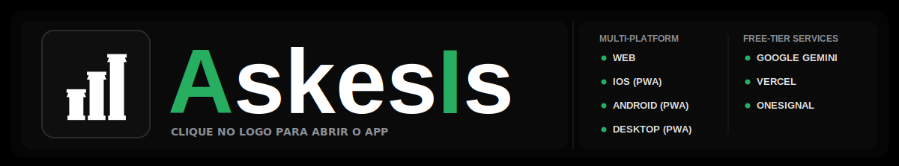
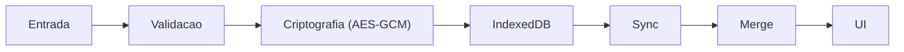

<!-- markdownlint-disable MD004 MD005 MD007 MD009 MD012 MD013 MD029 MD030 MD031 MD032 MD033 MD036 MD040 MD041 MD047 MD060 -->

<p align="left" style="margin: 0 0 4px 0; line-height: 0;">
  <a href="#pt-br" style="text-decoration: none; border: 0;"></a>&nbsp;
  <a href="README.en.md" style="text-decoration: none; border: 0;"></a>&nbsp;
  <a href="README.es.md" style="text-decoration: none; border: 0;"></a>
</p>

<div align="center" style="margin-top: 0; font-size: 0; line-height: 0;">
  <a href="https://askesis.vercel.app/" target="_blank" rel="noopener noreferrer" style="display: block; text-decoration: none; border: 0;">
    
  </a>
  
</div>

<a id="pt-br" style="text-decoration: none; color: black; font-size: 1.5em; cursor: default;"><b>PT-BR</b></a>

<div align="center">
  
</div>

Epígrafe do projeto — conecta direto com o propósito do Askesis como **rastreador de hábitos**: consistência e excelência se constroem pela prática diária, e **hábitos** são o mecanismo que o app ajuda a treinar e acompanhar.<br>


<table>
<tr>
<td>
<b>TABELA DE CONTEÚDO</b>
  
- [Visão do Projeto](#pt-visao-do-projeto)
- [IA Generativa como Assistente de Código e Prototipação](#pt-ai-assistant)
- [Guia de Uso (Passo a Passo)](#pt-guia-uso)
- [Principais Fluxos de Usuário](#pt-fluxos-usuario)
- [Plataforma Universal e Sustentabilidade](#pt-plataforma)
- [Arquitetura](#pt-arquitetura)
  - Visão Geral da Arquitetura e Fluxo do Usuário
  - Visão Geral de Integrações e Infraestrutura
  - Visão Geral do Ciclo de Dados
  - Diagramas Detalhados
- [Deep Dive Técnico](#pt-deep-dive-technical)
  - Estrutura de Dados: A Magia por Trás
  - Privacidade & Criptografia: Detalhes Técnicos
  - Testes, Validação e Qualidade
  - Vercel (Banda/Edge Functions)
- [Debugging e Monitoramento](#pt-debugging)
- [FAQ & Troubleshooting](#pt-faq)
- [Roadmap: o Futuro](#pt-roadmap)
- [Quem Quiser Contribuir](#pt-contribuir)
</td>
<td align="center" valign="middle">
  
</td>
</tr>
</table><br>

<a id="pt-visao-do-projeto"></a>
<a id="pt-resumo"></a>

<h1>Visão do Projeto</h1>

Rastreador de hábitos, focado em estoicismo, com IA para reflexões e ajustes nas citações.

<b>A MOTIVAÇÃO: POR QUE CONSTRUIR?</b>

Privacidade real dos dados e a capacidade de gerar código e criar aplicações completas usando IA Generativa (IA Gen):

1. **Soberania e Privacidade de Dados:** Garantia absoluta de que as informações não seriam compartilhadas, vendidas ou analisadas por terceiros. 

2. **Tecnologia Disponível:** Em uma era dominada por modelos de assinatura (SaaS), recusei-me a pagar por um software que pode ser construído ainda melhor com ajuda da IA Gen.

Meu objetivo: <b>Privacidade por desenho + criptografia + anonimato coletivo</b>

No Askesis os dados pertencem exclusivamente ao usuário e residem no seu dispositivo (ou no seu cofre pessoal criptografado). Além disso, no caso da IA adota-se uma prática conhecida como **anonimato coletivo** (*anonymity set*); como o app não exige identificação, o uso e os dados são **diluídos no conjunto de usuários**.

<b>A FILOSOFIA: O QUE É ASKESIS?</b>

**Askesis** (do grego *ἄσκησις*) é a raiz da palavra "ascetismo", mas seu significado original é muito mais prático: significa **"treinamento"** ou **"exercício"**.

Na filosofia estoica, *askesis* não se trata de sofrimento ou privação sem sentido, mas do **treinamento rigoroso e atlético da mente e do caráter**. Assim como um atleta treina o corpo para a competição, o estoico treina a mente para lidar com as adversidades da vida com virtude e tranquilidade.

A maioria dos apps de hábitos foca em gamificação superficial ou em "não quebrar a corrente". O Askesis foca na **virtude da consistência**. Ele usa Inteligência Artificial para atuar como um "Sábio Estoico", analisando seus dados não para julgar, mas para oferecer conselhos sobre como fortalecer sua vontade.

<br>
<a id="pt-ai-assistant"></a>
<h1>IA Gen como Assistente de Código e Prototipação</h1>

O Askesis não foi só “codificado”; foi **orquestrado** com IA Gen como parceira. Usei o Google AI Studio para prototipar conceitos iniciais e o GitHub Copilot no VS Code (via Codespaces) para refinar o código em tempo real.

- **Papel humano:** definir visão, arquitetura e prioridades; validar o que foi gerado via iteração de prompts e testes.
- **Papel da IA:** acelerar a implementação pesada, sugerir ajustes de performance e ajudar a eliminar bugs lógicos.

<a id="pt-build-paradigm"></a>
O resultado é uma aplicação que uma pessoa consegue levar a um nível de complexidade e polimento mais comum em um time 3-5 devs.


<b>PARADIGMA DE CONSTRUÇÃO: A ORQUESTRAÇÃO HUMANO-IA</b>


Esta tabela explicita onde a IA Gen oferece uma implementação rápida e onde minha visão de valor e intervenção incrementam o resultado técnico e dão passo à inovação.

---

| Recurso | Tradicional / IA “pura” | Minha intervenção (arquiteto) | Resultado: Askesis |
|---|---|---|---|
| Privacidade | Login obrigatório e dados em nuvem comercial. | Local-first por padrão; sync opt-in; E2E com AES-GCM no cliente (em Web Worker) e sem coleta de PII. | Dados ficam no dispositivo; na rede/servidor trafega e persiste apenas ciphertext. |
| Performance  | Frameworks pesados e re-renderizações custosas que adicionam latência. | Vanilla TypeScript + APIs nativas; bitmask-first/split-state; workers para tarefas CPU-bound; budgets cobertos por testes de cenário. | Budgets verificados (ex.: leituras massivas em < 50ms nos testes) e UI responsiva. |
| UX & Psicologia | Gamificação ruidosa (streaks, dopamina, competição) como padrão. | Diretriz de produto: reforçar a “virtude da consistência” com UX minimalista e feedback orientado à autorreflexão. | Menos ruído, mais aderência: o app serve ao treino mental, não à dependência. |
| Acessibilidade | A11y tratada como detalhe ou pós-facto. | Semântica HTML + ARIA, navegação por teclado e gestão de foco; validação contínua via testes de cenário de acessibilidade. | Experiência inclusiva e navegável sem mouse, com suporte prático a leitores de tela. |
| Confiabilidade | Testes unitários isolados ou baixa cobertura de falhas reais. | Suite de “super-testes” (jornada, conflitos de sync, performance, acessibilidade, segurança e disaster recovery). | Regressões detectadas cedo e comportamento resiliente sob estresse. |
| Sustentabilidade | Backend stateful, custos recorrentes e pressão por assinaturas/anúncios. | Arquitetura local-first; serverless apenas como ponte opcional; processamento pesado no dispositivo do usuário. | Infra enxuta e custo marginal baixo para escalar, sem monetização agressiva. |
| Eficiência | Apps inchados com bundles grandes e alto consumo de bateria/CPU. | Otimização de cores (LED-friendly), workers para offload de CPU e melhoria de FPS; comunicação local-first para reduzir transferências; testes de carga e budgets de dados. | Tempos de carga rápidos (< 2s inicial), bundles leves (< 60KB gzipped) e baixo impacto energético, priorizando dispositivos móveis. |

<br>

<a id="pt-guia-uso"></a>
<h1>Guia de Uso (Passo a Passo)</h1>

<br>
<p align="center">
  
</p>

O Askesis foi desenhado em camadas: intuitivo na superfície, mas repleto de ferramentas poderosas para quem busca profundidade.

<b>O FUNDAMENTO: ADICIONANDO HÁBITOS</b>

O hábito é a unidade fundamental da aplicação. O sistema permite rastrear não apenas a conclusão ("check"), mas também a quantidade e intensidade (páginas lidas, minutos meditados).

Para começar a construir sua rotina, você tem dois caminhos:
*   **Botão Verde Brilhante (+):** O ponto de partida principal no canto inferior.

<br>
<p align="center">
  
</p>

*   **O "Placeholder" (Espaço dos Cartões):** Se um período do dia (Manhã, Tarde, Noite) estiver vazio, você verá uma área convidativa ("Adicione um hábito") que permite a criação rápida direto no contexto temporal.

<br>
<p align="center">
  </p>

Uma vez criados, seus hábitos podem ser explorados e gerenciados de forma detalhada:

*   **Lista de Hábitos:** Explore uma lista de hábitos pré-definidos (como meditação, leitura, exercício) ou crie os seus próprios personalizados. Aqui, você pode gerenciar hábitos ativos e pausados conforme necessário.

<br>
<p align="center">  
</p>

*   **Modal do Hábito:** Você pode editar a meta padrão, ajustar o período do dia e muito mais.

<br>
<p align="center">  
</p>

*   **Modal de Troca de Ícone e Cor:** Dentro do modal do hábito, há uma seção dedicada à personalização visual. Escolha entre uma variedade de ícones representativos (como livros para leitura ou pesos para exercício) e cores que reflitam seu estilo pessoal, tornando a interface mais intuitiva e motivadora.

<br>
  <div style="text-align: center;">
    
    
  </div>

<br>
<b>O TEMPO E OS ANÉIS (O CALENDÁRIO)</b>

<br>

Se o hábito é o fundamento, o **Tempo** é o que dá sentido ao todo. A faixa de calendário no topo não é apenas decorativa; é a sua bússola de progresso.

Os dias são representados por **Anéis de Progresso Cônico**, uma visualização de dados que preenche o anel com as cores azul (feito) e branco (adiado), mostrando a composição exata do seu dia com um único olhar.

<br>
<p align="center">
  
</p>

**Micro-Ações do Calendário (Power User):**
A faixa de calendário possui atalhos ocultos para facilitar a gestão em massa:
*   **1 Clique:** Seleciona a data para visualizar o histórico.
*   **Pressionar e Segurar (Long Press):** Abre um menu de ações rápidas para **Completar o Dia**, **Adiar o Dia** ou abrir o **Calendário Mensal Completo**, permitindo saltar para qualquer data do ano rapidamente.

<br>
<p align="center">
  
</p>

<b>O CARTÃO DE HÁBITO: INTERAÇÃO DIÁRIA</b>

O cartão é a representação visual do seu dever no dia. Ele responde a diferentes tipos de interação:

*   **Cliques (Status):**
    *   **1 Clique:** Marca como ✅ **Feito**.
    *   **2 Cliques:** Marca como ➡️ **Adiado** (passa para o próximo estado).
    *   **3 Cliques:** Retorna para ⚪️ **Pendente**.
*   **Deslizar (Swipe - Opções Adicionais):**
    *   Ao deslizar o cartão para os lados, você revela ferramentas de contexto:
    *   **Criar Nota:** Adicione uma observação estoica sobre a execução daquele hábito no dia.
    *   **Apagar:** Permite remover o hábito. O sistema pedirá confirmação para garantir uma ação pensada.
*   **Arrastar (Drag & Drop - Reorganização):**
    *   Pressione e segure o cartão para iniciar o arraste.
    *   Mova o hábito entre Manhã, Tarde e Noite para ajustar sua rotina.
    *   Solte no novo bloco de horário para salvar a nova posição.

<br>
<div style="display: flex; justify-content: center; gap: 10px;">
    
  
</div>

<b>CONSELHO ESTOICO E ANÁLISE (IA)</b>

*   **Botão de IA (ícone no topo):** Abre o fluxo de conselho estoico contextual.
    *   **Análise por período:** Você pode pedir leitura mensal, trimestral ou histórica para receber diagnóstico e próxima ação prática.
    *   **Modo offline:** Se estiver sem internet, o app exibe um fallback com citação estoica para manter a experiência útil.

<br>
  <p align="center">
  
  </p>
    
*   **Frases Estoicas:** Logo embaixo do calendário, você encontrará reflexões de Marco Aurélio e outros estoicos. Clique na frase para lê-la em extenso.

<br>
  <p align="center">
  
  </p>

<b>GRÁFICO DE EVOLUÇÃO</b>

*   **Painel de tendência:** Mostra o comportamento recente dos hábitos e a direção da sua consistência.
*   **Leitura rápida:** Use o gráfico para identificar queda, estabilidade ou melhora e ajustar metas com base em evidência.
*   **Complemento dos anéis:** Os anéis mostram o dia; o gráfico mostra o padrão ao longo do tempo.

<br>
  <p align="center">
  
  </p>

<b>NAVEGAÇÃO</b>

*   **"Hoje":** Ao navegar pelo passado ou futuro, o título "Hoje" (ou a data) no topo funciona como um botão de retorno imediato ao presente.

  <br>
  <div style="text-align: center;">
    
    
    
  </div>
  <br>

<b>A ENGRENAGEM: CONFIGURAÇÕES E RESGATE</b>

O ícone de engrenagem no canto superior permite a configuração e gestão de todo o sistema:

<br>
<p align="center">
  
</p>

*   **Idioma:** Altere entre português, inglês e espanhol direto no seletor rotativo.
*   **Notificações:** Ative ou desative lembretes e veja o estado atual da permissão no próprio painel.
*   **Sincronização na Nuvem (Resgate de Perfil):**
    *   Ativar a sincronização gerando uma nova chave.
    *   Inserir uma chave existente para recuperar dados em outro dispositivo.
    *   Visualizar/copiar sua chave quando a sync já está ativa.
    *   Desativar a sincronização quando quiser operar somente local.
*   **Dados & Privacidade:**
    *   **Exportar Backup** para salvar um snapshot dos seus dados.
    *   **Restaurar Backup** para importar um arquivo válido do Askesis.
*   **Reinicialização:** Opção de apagar todos os dados locais com confirmação de segurança.
*   **Gerenciar Hábitos:** Lista completa de hábitos, podendo pausar ao fechar ou apagar hábitos e seu histórico.

<br>
  <p align="center">
  
  </p>


<br>
<a id="pt-fluxos-usuario"></a>
<details>
<summary><h1 style="display:inline; margin:0;">Principais Fluxos de Usuário</h1><span style="display:inline; font-family:ui-monospace, SFMono-Regular, Menlo, Consolas, monospace; font-size:0.85em; opacity:0.85;">&nbsp;&nbsp;(clique para expandir)</span>
</summary>

<br>

<b>FLUXO 1: NOVO USUÁRIO (ONBOARDING)</b><br>

```
1. Acessa askesis.vercel.app
   ↓
2. App inicializa (Local-first)
   ↓
3. loadState() tenta carregar estado do IndexedDB
   ↓
4. Se houver chave de sync: fetchStateFromCloud() roda no boot
   ↓
5. Usuário clica em "+"
   ↓
6. Modal "Explorar Hábitos" abre
   ↓
7. Escolhe um modelo (ou "Criar personalizado")
   ↓
8. Modal de edição abre (nome, horários, frequência e meta)
   ↓
9. Salva → saveHabitFromModal() cria/atualiza o hábito
   ↓
10. _notifyChanges() → saveState() (debounced) + render
   ↓
11. Se sync estiver ativa: syncStateWithCloud() agenda envio
   ↓
12. Usuário pode continuar offline (PWA + IndexedDB) ✅
```

<b>FLUXO 2: MARCAÇÃO DE STATUS (MÚLTIPLOS CLIQUES)</b><br>

```
Estado Inicial: ⚪ PENDENTE

Usuário clica 1x
   ↓ toggleHabitStatus()
  ↓ HabitService.setStatus(..., HABIT_STATE.DONE)
  ↓ _checkStreakMilestones() (quando aplicável)
  ↓ triggerHaptic('light')
  ↓ _notifyPartialUIRefresh() → saveState() debounced + updateDayVisuals()
Estado: ✅ FEITO

Usuário clica 2x
   ↓ toggleHabitStatus()
  ↓ HabitService.setStatus(..., HABIT_STATE.DEFERRED)
  ↓ triggerHaptic('medium')
  ↓ _notifyPartialUIRefresh()
Estado: ➡️ ADIADO

Usuário clica 3x
   ↓ toggleHabitStatus()
  ↓ HabitService.setStatus(..., HABIT_STATE.NULL)
  ↓ Tombstone bit é gravado no log binário (9-bit)
  ↓ triggerHaptic('selection')
  ↓ _notifyPartialUIRefresh()
Estado: ⚪ PENDENTE (status limpo via tombstone)
```

<b>FLUXO 3: SINCRONIZAÇÃO MULTI-DISPOSITIVO</b><br>

```
1. Mudança local acontece (toggle/edição/import)
  ↓
2. saveState() persiste no IndexedDB
  ↓
3. registerSyncHandler(...) chama syncStateWithCloud(snapshot)
  ↓
4. syncStateWithCloud() define pendingSyncState + debounce
  ↓
5. performSync() envia apenas shards alterados para POST /api/sync
  ↓
6. Se houver conflito (409): resolveConflictWithServerState()
  ↓
7. mergeStates(local, remoto) + persistStateLocally() + loadState()
  ↓
8. renderApp() atualiza UI com estado consolidado
  ↓
9. Em falhas transitórias/offline: estado fica pendente e tenta novamente

Resultado Final:
✅ Estratégia Local-first preserva uso offline
✅ Sincronização eventual ao reconectar
✅ Merge de conflitos sem sobrescrever cegamente o estado local
```

<b>FLUXO 4: ANÁLISE IA (DIAGNÓSTICO DIÁRIO)</b><br>

```
1. renderStoicQuote() roda para a data selecionada
  ↓
2. Se não existe diagnóstico no dia: emitRequestAnalysis(data)
  ↓
3. listeners.ts recebe APP_EVENTS.requestAnalysis
  ↓
4. checkAndAnalyzeDayContext(data) processa notas do dia
  ↓
5. Guardrails: sem notas, offline, histórico insuficiente ou análise recente → aborta
  ↓
6. Worker monta prompt (build-quote-analysis-prompt)
  ↓
7. POST /api/analyze com prompt + systemInstruction
  ↓
8. Resposta válida salva:
  state.dailyDiagnoses[data] = { level, themes, timestamp }
  ↓
9. saveState() persiste e a citação adaptada usa o nível retornado
```

<b>FLUXO 5: CELEBRAÇÃO DE MILEPOSTS (21 & 66 DIAS)</b><br>

```
1. Usuário marca hábito como DONE
  ↓ toggleHabitStatus()
2. _checkStreakMilestones(hábito, data)
  ↓
3. calculateHabitStreak(...) calcula streak atual
  ↓
4. Se streak == 21: adiciona em pending21DayHabitIds
  ↓
5. Se streak == 66: adiciona em pendingConsolidationHabitIds
  ↓
6. renderAINotificationState() acende indicador no botão IA
  ↓
7. Ao abrir IA: consumeAndFormatCelebrations() monta mensagem
  ↓
8. IDs são movidos para notificationsShown e listas pendentes são limpas

Resultado:
✅ Celebrações são exibidas in-app
✅ Sem duplicar o mesmo milestone do mesmo hábito
✅ Persistência de histórico de celebrações após saveState()
```

</details>

<br>
<br>
<a id="pt-plataforma"></a>
<h1>Plataforma Universal e Sustentabilidade</h1>

O Askesis foi construído com a premissa de que a tecnologia deve se adaptar ao usuário, não o contrário.

<b style="display:inline; margin:0; padding:0; border:0;">EXPERIÊNCIA UNIVERSAL (PWA)</b><br>

O Askesis é um **Progressive Web App (PWA)** de última geração. Isso significa que ele combina a ubiquidade da web com a performance de aplicativos nativos.

*   **Instalável:** Adicione à tela inicial do iOS, Android, Windows ou Mac. Ele se comporta como um app nativo, removendo a barra do navegador e integrando-se ao sistema operacional.
*   **Offline-First:** Graças a uma estratégia avançada de *Service Workers*, o aplicativo carrega instantaneamente e é **totalmente funcional sem internet**. Você pode marcar hábitos, ver gráficos e editar notas no meio de um voo ou no metrô.
*   **Sensação Nativa:** Implementação de feedback tátil (Haptics) em micro-interações, gestos de deslize (swipe) fluídos e animações de 60fps garantem uma experiência tátil e responsiva.


<b style="display:inline; margin:0; padding:0; border:0;">INCLUSÃO (A11Y) E LOCALIZAÇÃO</b><br>

A disciplina estoica é para todos. O código do Askesis segue rigorosos padrões de acessibilidade (WCAG) para garantir que pessoas com diferentes necessidades possam usar a ferramenta plenamente.

*   **Semântica Robusta:** Uso correto de elementos HTML semânticos e atributos ARIA (`aria-label`, `role`, `aria-live`) para garantir que **Leitores de Tela** interpretem a interface corretamente.
*   **Navegação por Teclado:** Todo o aplicativo é navegável sem mouse. Modais possuem "Focus Traps" para evitar que o foco se perca, e atalhos (como `Enter` e `Espaço`) funcionam em todos os elementos interativos.
*   **Respeito ao Usuário:** O aplicativo detecta e respeita a preferência do sistema por **Movimento Reduzido** (`prefers-reduced-motion`), desativando animações complexas para evitar desconforto vestibular.
*   **Legibilidade:** Contraste de cores calculado dinamicamente para garantir legibilidade em qualquer tema escolhido pelo usuário.

**SUPORTE MULTILÍNGUE (I18N)**

O Askesis suporta 3 idiomas nativamente com fallback inteligente:

```typescript
LANGUAGES = {
  'pt': 'Português (Brasil)',
  'en': 'English',
  'es': 'Español'
}

// Sistema de tradução:
// 1. Busca chave no idioma preferido
// 2. Se não existir, volta para 'en' (padrão)
// 3. Se nem em 'en', retorna a chave como fallback
```

**Exemplos de Chaves de Tradução:**
```
aiPromptQuote       → Prompt para análise de citações
aiSystemInstruction → Instruções do Sábio Estoico
aiCelebration21Day  → Celebração dos 21 dias
aiCelebration66Day  → Celebração dos 66 dias
habitNameCheckin    → "Check-in"
timeOfDayMorning    → "Manhã"
streakCount         → "{count} dias seguidos"
```

**Locales com Inteligência:**
```typescript
// Formatação de datas por idioma:
pt-BR: "15 de janeiro de 2025"
en-US: "January 15, 2025"
es-ES: "15 de enero de 2025"

// Números e percentuais respeitam locale
pt-BR: "1.234,56" (vírgula como decimal)
en-US: "1,234.56" (ponto como decimal)
es-ES: "1.234,56" (igual PT)
```

<b>ARQUITETURA ZERO COST & SUSTENTABILIDADE</b><br>

Este projeto foi desenhado com uma engenharia inteligente para operar com **Custo Zero ($0)**, aproveitando os planos gratuitos de serviços modernos sem perder qualidade.<br>

*   **Armazenamento Ultraleve (GZIP):** Os dados históricos ("Cold Storage") são comprimidos via GZIP Stream API antes de serem salvos ou enviados para a nuvem. Isso reduz drasticamente o uso de banda e armazenamento.
*   **O Celular Trabalha:** A maior parte do "pensamento" (criptografia, geração de gráficos, cálculos) é feita pelo seu próprio dispositivo, não pelo servidor. Isso poupa recursos da nuvem, garantindo que nunca ultrapassemos os limites gratuitos.
*   **Notificações Gratuitas:** Utilizamos o plano de comunidade do OneSignal, que permite até 10.000 usuários Web gratuitamente.

<b>ESTIMATIVAS DE CAPACIDADE (COM BASE EM LIMITES GRATUITOS)</b><br>

Considerando as três plataformas **simultaneamente** (Gemini, Vercel e OneSignal), o limite prático da app é dado pelo **menor teto** entre elas:

- **Gemini Flash:** ~**500 usuários/dia** (1.000 req/dia ÷ 2 req/usuário/dia)
- **Vercel (100 GB/mês):** ~**1.780 usuários/mês** (≈ 57,5 MB/usuário/mês)
- **OneSignal:** **10.000 usuários** (limite por subscribers)

**Conclusão:** o gargalo atual é o **Gemini Flash (≈ 500 usuários/dia)**. Mesmo que Vercel e OneSignal suportem mais, a IA é o limitador antes de depender de colaboração comunitária ou ajustes de infraestrutura.

<a id="pt-highlights"></a><br>
<a id="pt-arquitetura"></a>
<h1>Arquitetura</h1>

<a id="pt-architecture-user-flow"></a>
<b>VISÃO GERAL DA ARQUITETURA E FLUXO DO USUÁRIO</b><br>

<p align="center">
  
</p>

<span style="font-size: 0.8em;">Este diagrama ilustra o ciclo de vida principal da aplicação, estruturado em três fases fundamentais:

- Fase 1: Definição (Onboarding): Criação e customização de hábitos com foco absoluto em privacidade, utilizando uma abordagem Local-first com criptografia de ponta a ponta (E2E).
- Fase 2: Execução (Engajamento): Gerenciamento diário, métricas de performance e persistência de dados. A interface (Main Thread) é isolada do processamento de dados (Worker), utilizando IndexedDB para armazenamento local e protocolo CRDT-lite para sincronização sem conflitos com a nuvem (Vercel KV).
- Fase 3: Inteligência (Feedback): Um motor de análise avalia os dados do usuário para gerar insights comportamentais personalizados, injetando esse contexto de volta na experiência para criar um loop de engajamento contínuo.</span>


<a id="pt-integrations-infra"></a>
<b>VISÃO GERAL DE INTEGRAÇÕES E INFRAESTRUTURA</b><br>

<p align="center">
  
</p>

<span style="font-size: 0.8em;">Este diagrama detalha a arquitetura de alto nível do sistema e o fluxo de comunicação entre os serviços externos:

- Cliente (Askesis PWA): A interface em React que interage com o usuário no dia a dia, gerenciando o estado local e iniciando as requisições.
- Backend Serverless (Vercel API): Atua como uma camada intermediária segura. Ele gerencia a sincronização de estado e funciona como um "Proxy de IA", protegendo as chaves de API e validando as requisições antes de enviá-las ao modelo de linguagem.
- Motor de IA (Google Gemini API): O cérebro por trás da análise, recebendo os dados filtrados pelo backend para processar as reflexões e gerar insights personalizados.
- Notificações (OneSignal): Serviço de mensageria independente que registra o PWA e cuida do envio de notificações push assíncronas para engajar o usuário de volta no aplicativo.</span>

<a id="pt-data-lifecycle"></a>
<b>VISÃO GERAL DO CICLO DE DADOS</b><br>



<a id="pt-c4-l3"></a>
<b>DIAGRAMAS DETALHADOS</b>

<b>Arquitetura Interna</b>

Arquitetura em camadas: Apresentação (UI), Domínio (lógica/estado), Infraestrutura (persistência/sync). Detalhes em [docs/ARCHITECTURE.md#componentes-internos](docs/ARCHITECTURE.md#componentes-internos).


<b> Fluxo de Dados</b>

Modelo local-first: salvamento em IndexedDB, sync incremental criptografado (shards via Web Worker, merge com LWW/deduplicação). Diagrama em [docs/ARCHITECTURE.md#fluxo-dados](docs/ARCHITECTURE.md#fluxo-dados).


<b>Fluxo de Conflito de Sync</b>

Conflitos: descriptografia remota, merge com LWW/deduplicação, persistência e retry. Diagrama em [docs/ARCHITECTURE.md#fluxo-conflito](docs/ARCHITECTURE.md#fluxo-conflito).

<br>
<a id="pt-deep-dive-technical"></a>
<details>
<summary><h1 style="display:inline; margin:0;">Deep Dive Técnico</h1><span style="display:inline; font-family:ui-monospace, SFMono-Regular, Menlo, Consolas, monospace; font-size:0.85em; opacity:0.85;">&nbsp;&nbsp;(clique para expandir)</span>
</summary>

<br>

<b>ESTRUTURA DE ARQUIVOS</b><br>

```text
.
├── api/                 # Vercel Edge Functions (Backend Serverless)
├── assets/              # Imagens/flags/diagramas usados no app/README
├── css/                 # CSS modular (layout, componentes, etc.)
├── data/                # Dados estáticos (quotes, hábitos pré-definidos)
├── icons/               # Ícones (SVG) e assets relacionados
├── locales/             # Arquivos de Tradução (i18n)
├── render/              # Motor de Renderização (DOM Recycling & Templates)
├── listeners/           # Controladores de Eventos e Gestos
├── services/            # Camada de Dados, Criptografia e IO
│   ├── api.ts           # Cliente HTTP
│   ├── cloud.ts         # Orquestrador de Sync e Worker Bridge
│   ├── crypto.ts        # Criptografia AES-GCM Isomórfica
│   ├── dataMerge.ts     # Resolução de Conflitos (CRDT-lite)
│   ├── habitActions.ts  # Lógica de Negócios (ações sobre hábitos)
│   ├── migration.ts     # Migrações de schema/bitmasks
│   ├── persistence.ts   # Wrapper IndexedDB Assíncrono
│   ├── quoteEngine.ts   # Motor de seleção de citações
│   ├── selectors.ts     # Camada de leitura otimizada (memoized)
│   └── sync.worker.ts   # Web Worker para tarefas CPU-bound
├── tests/               # Testes de cenário (resiliência, performance, segurança)
├── state.ts             # Estado global (Single Source of Truth)
├── render.ts            # Facade/orquestrador de render (re-export)
├── listeners.ts         # Setup de listeners (bootstrap)
├── index.tsx            # Entry point
├── index.html           # App Shell (Critical Render Path)
└── sw.js                # Service Worker (Atomic Caching)
```

<a id="pt-project-structure"></a>
<b>ESTRUTURA DO PROJETO</b><br>

- Backend serverless: [api/](api/)
- Renderizacao: [render/](render/)
- Gestos e eventos: [listeners/](listeners/)
- Dados e criptografia: [services/](services/)


<a id="pt-modules-map"></a>

**MAPA RÁPIDO DE MÓDULOS (PASTA → RESPONSABILIDADE)**

- render/: composição visual, diffs de DOM, modais, calendário e gráficos.
- listeners/: eventos de UI (cards, modal, swipe/drag, calendário, sync).
- services/: domínio e infraestrutura (habitActions, selectors, persistence, cloud, dataMerge, analysis, quoteEngine, HabitService).
- api/: endpoints serverless edge (/api/sync, /api/analyze) com rate-limit, CORS e hardening.
- state.ts: modelo canônico de estado, tipos e caches.
- services/sync.worker.ts: criptografia AES-GCM e construção de prompts IA fora da main thread.
- tests/ e services/*.test.ts: cenários de jornada, segurança, resiliência, merge e regressão.


**PRINCIPAIS ASPECTOS TÉCNICOS**

O Askesis opera no "Sweet Spot" da performance web, utilizando APIs nativas modernas para superar frameworks:

---

| Aspecto | Descrição | Benefício |
|---------|-----------|-----------|
| **Arquitetura de Dados "Bitmask-First"** | Estado de hábitos em mapas de bits (`BigInt`) para verificações `O(1)` e memória mínima. | Consultas instantâneas de histórico sem impacto na performance, mesmo com anos de dados. |
| **Persistência "Split-State"** | IndexedDB separa dados quentes/frios para inicialização instantânea. | App abre em segundos, sem parsing desnecessário de dados antigos. |
| **Física de UI com APIs Avançadas** | Interações fluidas via Houdini e `scheduler.postTask` para UI sem bloqueios. | Animações suaves e responsivas, melhorando a experiência do usuário em qualquer dispositivo. |
| **Multithreading (Web Workers)** | Tarefas pesadas (cripto, parsing, IA) isoladas em workers para UI Jank-free. | Interface sempre fluida, sem travamentos durante operações intensas. |
| **Criptografia Zero-Copy** | AES-GCM off-main-thread com `ArrayBuffer` direto, eficiente em dispositivos modestos. | Segurança máxima sem sacrificar velocidade, mesmo em celulares básicos. |
| **Sincronização Inteligente (CRDT-lite)** | Resolução de conflitos com pesos semânticos, progresso sempre preservado. | Sync confiável entre dispositivos, sem perda de dados ou conflitos manuais. |

<a id="pt-tech"></a>

<b>TECNOLOGIA</b><br>

- TypeScript puro, sem frameworks.
- PWA com Service Worker e cache atomico.
- Criptografia AES-GCM e sync resiliente.
- Renderizacao eficiente e UI responsiva.

**MAPA RAPIDO DE FLUXOS**

| Fluxo | Entrada | Saida |
|---|---|---|
| Status diario | Tap no card | Bitmask + render imediato |
| Privacidade | Dados locais | AES-GCM em worker |
| Offline-first | Service Worker | Cache atomico |
| Sincronizacao | Chave de sync | Merge resiliente |


<b style="display:inline; margin:0; padding:0; border:0;">ESTRUTURA DE DADOS: A MAGIA POR TRÁS</b>

O Askesis utiliza estruturas de dados altamente otimizadas que são raramente vistas em aplicações web. Compreender essa escolha é compreender por que o app é tão rápido:

<br>

**🔢 O SISTEMA DE BITMASK 9-BIT**

Cada hábito é armazenado de forma comprimida usando **BigInt** (inteiros arbitrariamente grandes do JavaScript).

```
Cada dia ocupa 9 bits (para 3 períodos: Manhã, Tarde, Noite):

┌───────────────────────────────────────────────────────────────────────────────────────────────┐
│ Dia = [Tombstone(1 bit) | Status Noite(2) | Status Tarde(2) | Status Manhã(2) | Reserved(2) ] │
└───────────────────────────────────────────────────────────────────────────────────────────────┘

Estados possíveis (2 bits cada):
  00 = Pendente (não iniciado)
  01 = Feito (completed)
  10 = Adiado (deferred/snoozed)
  11 = Reservado para expansão futura

Exemplo de 1 mês (30 dias):
  - Sem compressão:   30 dias × 3 períodos × 8 bytes = 720 bytes
  - Com bitmask:      30 dias × 9 bits = 270 bits ≈ 34 bytes (21x menor!)
  - GZIP:             34 bytes → ~8 bytes comprimido
```

**Operações Bitwise O(1):**
```typescript
// Ler status de um hábito em 2025-01-15 na Manhã:
const status = (log >> ((15-1)*9 + PERIOD_OFFSET['Morning'])) & 3n;

// Escrever status:
log = (log & clearMask) | (newStatus << bitPos);

// Isso é **instantâneo** mesmo com 10+ anos de dados!
```

**📦 SPLIT-STATE STORAGE: JSON + BINARY**

O IndexedDB do Askesis armazena dados em **duas colunas separadas**:

```
┌──────────────────────────────────────────┐
│ IndexedDB (AskesisDB)                    │
├──────────────────────────────────────────┤
│ KEY: "askesis_core_json"                 │
│ VALUE: {                                 │
│   version: 9,                            │
│   habits: [Habit[], ...],                │
│   dailyData: Record<>,                   │
│   ... (tudo exceto monthlyLogs)          │
│ }                                        │
│ SIZE: ~50-200 KB (mesmo com 5 anos)      │
├──────────────────────────────────────────┤
│ KEY: "askesis_logs_binary"               │
│ VALUE: {                                 │
│   "habit-1_2024-01": "a3f4e8c...",       │ ← Hex string (9-bit logs)
│   "habit-1_2024-02": "b2e5d1a...",       │
│   ...                                    │
│ }                                        │
│ SIZE: ~8-15 KB (mesmo com 5 anos)        │
└──────────────────────────────────────────┘
```

**Benefícios:**
- **Startup instantâneo:** JSON carrega em < 50ms, binários sob demanda
- **Backup eficiente:** Exportar dados = apenas o JSON (< 200 KB)
- **Migração segura:** Versiones antigas + novas coexistem sem conflitos

**🔗 TOMBSTONE PATTERN: SOFT DELETE COM SEGURANÇA DE SYNC**

Quando você deleta um hábito, o Askesis **não o apaga**. Em vez disso, marca com um "Túmulo" (Tombstone):

```
┌───────────────────────────────────────┐
│ DELETE HABITO 'Meditar'               │
├───────────────────────────────────────┤
│ 1. Ao invés de: habits.remove(id)     │
│    Faz:         habit.deletedOn = now │
│                                       │
│ 2. Marca no bitmask:                  │
│    Bit 8 (Tombstone) = 1              │
│    (Força todos os bits para 0)       │
│                                       │
│ 3. Benefit:                           │
│    - Se sync não chegou a outro app,  │
│      ele recebe DELETE + Sincroniza   │
│    - Histórico preservado para backup │
│    - Undo é possível (re-ativar)      │
└───────────────────────────────────────┘
```

**Exemplo real:**
```typescript
// Usuário deleta 'Meditar' em 2025-02-01
habitActions.requestHabitPermanentDeletion('habit-123');

// No bitmask, 2025-02-01 vira:
// 100 | 00 | 00 | 00 | 00 = 4 (Tombstone ativo)

// Ao sincronizar com outro dispositivo:
// 1. Servidor recebe tombstone bit
// 2. Propaga DELETE para todos os clientes
// 3. Histórico anterior é preservado em archives/
```

**🧬 CRDT-LITE: RESOLUÇÃO DE CONFLITOS SEM SERVIDOR**

Quando dois dispositivos sincronizam com mudanças conflitantes, o Askesis resolve automaticamente **sem precisar de um servidor de autoridade**:

```
┌─── Device A (Offline por 2 dias) ──────┐
│ 2025-01-15 Manhã: FEITO                │
│ 2025-01-16 Tarde: ADIADO               │
└────────────────────────────────────────┘
                ↓ Reconecta
┌─── Cloud State ────────────────────────┐
│ 2025-01-15 Manhã: ADIADO (Device B)    │
│ 2025-01-16 Tarde: PENDENTE (Device B)  │ 
└────────────────────────────────────────┘
                ↓ Merge (CRDT)
┌─── Resultado (Convergência) ───────────┐
│ 2025-01-15 Manhã: FEITO ✅             │
│   (Razão: FEITO > ADIADO = mais forte) │
│ 2025-01-16 Tarde: ADIADO               │
│   (Razão: ADIADO > PENDENTE = mais     │
│    próximo da conclusão)               │
└────────────────────────────────────────┘
```

**Semântica da resolução:**
```
Precedência de estado:
FEITO (01) > ADIADO (10) > PENDENTE (00)

Lógica: max(a, b) entre os dois valores 2-bit
```

Isso garante que o usuário **nunca perde progresso** ao sincronizar.

<b style="display:inline; margin:0; padding:0; border:0;">PRIVACIDADE & CRIPTOGRAFIA: DETALHES TÉCNICOS</b>

<br>

O Askesis implementa criptografia end-to-end de forma que **nem o servidor conhece seus dados**:
<br>

**🔐 FLUXO DE CRIPTOGRAFIA AES-GCM (256-BIT)**

```
┌─ Dados do Usuário (Plaintext) ───┐
│ {                                │
│   habits: [...],                 │
│   dailyData: {...},              │
│   monthlyLogs: Map<>             │
│ }                                │
└──────────────────────────────────┘
         ↓ JSON.stringify()
┌─ Serialização ───────────────────┐
│ "{\"habits\":[...], ...}"        │
└──────────────────────────────────┘
         ↓ Gera SALT + IV aleatórios
┌─ Derivação de Chave (PBKDF2) ───┐
│ Password: "sync_key_do_usuario" │
│ Salt: 16 bytes aleatórios       │
│ Iterations: 100.000 (segurança) │
│ Output: 256-bit key             │
└─────────────────────────────────┘
         ↓ AES-GCM.encrypt()
┌─ Cifra (Ciphertext) ────────────┐
│ SALT (16 bytes) +               │
│ IV (12 bytes) +                 │
│ ENCRYPTED_DATA (N bytes) +      │
│ AUTH_TAG (16 bytes)             │
│                                 │
│ Total: 44 + N bytes             │
└─────────────────────────────────┘
         ↓ Base64
┌─ Transporte (Seguro para URL) ──┐
│ "AgX9kE2...F3k=" ← Base64       │
│ Enviado para POST /api/sync     │
└─────────────────────────────────┘
         ↓ No Servidor
┌─ Servidor (Sem Conhecimento) ─────┐
│ Recebe apenas a string B64        │
│ Armazena tal qual                 │
│ Sem capacidade de descriptografar │
│ (não tem a senha do usuário)      │
└───────────────────────────────────┘
```

**🔄 SINCRONIZAÇÃO DE MÚLTIPLOS DISPOSITIVOS**

Cada dispositivo posssuem sua própria **chave de sincronização independente**:

```
┌─ Device A (Celular) ─────────────┐
│ Sync Key: "abc123def456"         │
│ Encripta: dados com "abc123..."  │
└──────────────────────────────────┘
                  ↓
          ☁️ Cloud Storage
          (Sem accesso de D.B)
                  ↓
┌─ Device B (Tablet) ──────────────┐
│ Sync Key: "abc123def456"         │
│ (Mesmo usuário = mesma chave)    │
│ Descripta: usando "abc123..."    │
└──────────────────────────────────┘
```

**Cenário offline:**
```
Device A (offline) → Local changes → Enqueue
Device A (online)  → POST encrypted data
Server             → Store & merge
Device B (online)  → GET encrypted data
Device B           → Decrypt & merge
Device B           → Render updated state
```

<a id="pt-tests-quality"></a>
<b style="display:inline; margin:0; padding:0; border:0;">TESTES, VALIDAÇÃO E QUALIDADE</b>

<br>

A confiabilidade do Askesis é validada por uma suíte ampla, com foco em cenários reais de uso, segurança, acessibilidade, desempenho e resiliência.

- Cobertura de cenarios de usuario, seguranca, acessibilidade e resiliencia.
- CI: workflow em `.github/workflows/ci.yml` roda testes/build e publica artifacts (dist + coverage).
- Para evitar divergência entre documentação e execução real, o detalhamento operacional da suíte (inventário, contagens atuais, fluxo diário, checklist de PR e convenção de atualização) fica centralizado em [tests/README.md](tests/README.md).

Resumo rápido:
- Execução completa: `npm test -- --run`
- Cenários de integração: `npm run test:scenario`
- Cobertura: `npm run test:coverage`
- Detalhes atualizados da suíte: [tests/README.md](tests/README.md)

> Rodar uma instancia propria e possivel, mas reduz o anonimato coletivo.

<a id="pt-guia-completo"></a>
<b style="display:inline; margin:0; padding:0; border:0;">VERCEL (BANDA/EDGE FUNCTIONS)</b><br>

**Production**
```bash
CORS_ALLOWED_ORIGINS=https://askesis.vercel.app
CORS_STRICT=1
ALLOW_LEGACY_SYNC_AUTH=0
AI_QUOTA_COOLDOWN_MS=90000
SYNC_RATE_LIMIT_WINDOW_MS=60000
SYNC_RATE_LIMIT_MAX_REQUESTS=120
ANALYZE_RATE_LIMIT_WINDOW_MS=60000
ANALYZE_RATE_LIMIT_MAX_REQUESTS=20
```

**Preview**
```bash
CORS_ALLOWED_ORIGINS=https://askesis.vercel.app
CORS_STRICT=1
ALLOW_LEGACY_SYNC_AUTH=0
AI_QUOTA_COOLDOWN_MS=90000
SYNC_RATE_LIMIT_WINDOW_MS=60000
SYNC_RATE_LIMIT_MAX_REQUESTS=200
ANALYZE_RATE_LIMIT_WINDOW_MS=60000
ANALYZE_RATE_LIMIT_MAX_REQUESTS=40
```

**Development**
```bash
CORS_ALLOWED_ORIGINS=http://localhost:5173
CORS_STRICT=0
ALLOW_LEGACY_SYNC_AUTH=1
AI_QUOTA_COOLDOWN_MS=30000
DISABLE_RATE_LIMIT=1
```

Observação: com `CORS_STRICT=1`, o backend também permite a origem do próprio deploy atual (produção ou preview) via host encaminhado da Vercel, mantendo bloqueio para origens externas.

</details>

<br><br>

<a id="pt-debugging"></a>
<h1>Debugging e Monitoramento</h1>

O Askesis fornece monitoramento nativo no próprio app, sem depender de DevTools para o uso normal.

**PAINEL DE SINCRONIZAÇÃO (SYNC DEBUG MODAL)**

Como abrir pelo fluxo normal do produto:
1. Abra **Gerenciar** (ícone de engrenagem).
2. Entre em **Sincronização na Nuvem**.
3. Toque no indicador de status de sync (texto de estado) para abrir o modal de diagnóstico.

No modal, você acompanha o histórico técnico da sincronização em tempo real, por exemplo:
```
✅ Sincronizando 3 pacotes...
✅ Nuvem atualizada.
ℹ️ Sem novidades na nuvem.
⚠️ Servidor de sync temporariamente indisponível. Reenfileirado.
❌ Falha no envio: Erro 401
```

**Por que é útil?**
- Confirmar se os dados chegaram na nuvem
- Entender se o app está em `syncSaving`, `syncSynced`, `syncError` ou `syncInitial`
- Identificar cenários de offline, retry automático e conflitos

**Leitura rápida dos estados**
```
syncInitial  → Sync desativada / sem chave local
syncSaving   → Alterações pendentes sendo enviadas
syncSynced   → Estado local e nuvem alinhados
syncError    → Falha não transitória (exige atenção)
```

**Quando agir**
- `syncSaving` por pouco tempo: comportamento esperado (debounce + envio em lote)
- `syncSaving` por muito tempo: verificar conexão e abrir o painel de diagnóstico
- `syncError`: revisar chave de sincronização e status da rede
- Mensagens de “Reenfileirado”: falha transitória, o app tentará novamente automaticamente
<br>
<br>

<a id="pt-roadmap"></a>
<h1>Roadmap: o Futuro</h1>

A visão para o Askesis é expandir sua presença nativa mantendo a base de código unificada.


- **Menor atrito diário:** reduzir a lacuna entre intenção e execução (check-ins de hábitos em segundos através de fluxos rápidos e contextuais).
  - **Marcação Rápida (quase sem abrir o app):** PWAs puras não podem marcar hábitos 100% em background sem interação do usuário. Como alternativa prática, usar ações push interativas (OneSignal/FCM) e atalhos de app com `/quick-mark?period=...` para abrir uma visualização mínima, marcar e retornar rapidamente.
- **Distribuição mais ampla com uma base de código:** manter uma estratégia web-first enquanto expande o alcance no Android através de TWA/Play Store.
  - **Play Store via Bubblewrap (TWA):** Preparar manifest/splash para empacotamento Android com `@bubblewrap/cli`, gerar APK com `bubblewrap init --manifest=https://askesis.vercel.app/manifest.json`, adicionar capacidades nativas leves (ex.: push via FCM), e validar em dispositivos Android.
- **Maior soberania tecnológica:** reduzir dependências externas com opções self-hosted (LLM local) e arquitetura sustentável de baixo custo.
  - **LLM Local Opcional (Qwen small):** Alternativa self-hosted ao Gemini para reduzir custo recorrente e aumentar controle de privacidade em ambientes compatíveis.

<br>
<br>

<a id="pt-faq"></a>
<details>
<summary><h1 style="display:inline; margin:0;">FAQ & Troubleshooting</h1><span style="display:inline; font-family:ui-monospace, SFMono-Regular, Menlo, Consolas, monospace; font-size:0.85em; opacity:0.85;">&nbsp;&nbsp;(clique para expandir)</span></summary>

<br>

**P: Meus dados estão realmente privados?**

R: Sim. Por padrão, todos os dados são armazenados localmente no seu dispositivo via IndexedDB. Se você optar por sincronização, a criptografia end-to-end (AES-GCM) é aplicada, e **nem o servidor tem acesso à sua senha de sincronização**. Apenas dados criptografados viajam pela rede.

**P: Posso perder meus dados se mudar de celular?**

R: Não, se você guardou sua **Chave de Sincronização**. Guarde essa chave em um local seguro (gerenciador de senhas, nota protegida). Ao instalar o Askesis em um novo celular, insira a chave e todos os seus dados serão sincronizados automaticamente.

**P: Como funciona a sincronização se eu estiver offline?**

R: Mudanças são enfileiradas localmente. Quando você reconecta à internet, todas as pendências são sincronizadas automaticamente. Não há perda de dados.

**P: A IA (Google Gemini) vê meus dados?**

R: Não. O Gemini recebe apenas:
- Notas que você adicionou (totalmente opcionais)
- Contexto generalizado (temas estoicos, não dados pessoais)
- Ele não tem acesso a datas, histórico ou identificadores

**P: Posso usar o Askesis em múltiplos dispositivos?**

R: Sim! Cada dispositivo usa a mesma **Chave de Sincronização** para manter dados em sync. Celular, tablet e desktop podem ser sincronizados.

**P: E se eu esquecer minha Chave de Sincronização?**

R: Infelizmente, você **não pode recuperá-la** (isso é por design — garante que nem o servidor a tem). Mas seus dados locais não se perdem. Você pode:
1. Continuar usando o Askesis naquele dispositivo apenas
2. Gerar uma nova chave e começar uma nova sincronização
3. Exportar dados em JSON antes de mudar (⚙️ → Exportar)

**P: Quanto espaço o Askesis usa?**

R: Muito pouco. Mesmo com 5 anos de histórico:
- **Dados principais (JSON):** ~50-200 KB
- **Logs binários comprimidos:** ~8-15 KB
- **Total:** < 500 KB para a maioria dos usuários

**P: O app funciona totalmente offline?**

R: Sim, **100%**. Você pode marcar hábitos, adicionar notas, ver gráficos — tudo sem internet. A IA (Google Gemini) e notificações (OneSignal) requerem conexão, mas são opcionais.

**P: Como desinstalo o Askesis?**

R: Se instalou como PWA:
- **Android:** Segure o ícone → "Desinstalar"
- **iOS:** Segure o ícone → "Remover app"
- **Desktop:** Controle-clique (Windows) ou Cmd-clique (Mac) no atalho → "Remover"

Seus dados locais são deletados automaticamente. Se quiser preservar dados, exporte primeiro (⚙️ → Exportar).

---

**🔧 TROUBLESHOOTING COMUM**

<h4>❌ "Erro: Sync não funciona"</h4>

**Diagnóstico:**
1. Verifique se está online (abra google.com em abas novas)
2. Abra DevTools (F12) → Console
3. Procure por erros vermelhos

**Soluções:**
```
Se vir "[API] Network Error":
  → Firewall ou proxy bloqueando
  → Tente em rede diferente (pedir WiFi de amigo)
  → Abra https://askesis-psi.vercel.app no navegador (deve carregar)

Se vir "[API] Timeout after 5s":
  → Sua conexão é lenta
  → Tente em lugar com WiFi melhor
  → Se em celular, use dados móveis de teste

Se vir "Sync Key inválido":
  → Chave foi corrompida/digitada errado
  → ⚙️ → Copiar Chave novamente
  → Tente sincronizar em outro dispositivo com a mesma chave
```

**Se o problema persistir:**
1. Abra o Painel de Sync: `openSyncDebugModal()` no console
2. Screenshot do histórico de sync
3. Procure por uma issue existente no [GitHub](https://github.com/farifran/Askesis/issues)
4. Se não existir, abra uma issue com o screenshot

<h4>❌ "Dados desapareceram!"</h4>

**Antes de desesperar:**

1. **Verificar localStorage não foi limpo:**
   ```
   F12 → Application → Storage → Local Storage → askesis-psi.vercel.app
   Você deve ver uma entrada "habitTrackerSyncKey"
   ```

2. **Verificar IndexedDB:**
   ```
   F12 → Application → Storage → IndexedDB → AskesisDB
   Você deve ver "app_state" e possivelmente "askesis_logs_binary"
   ```

3. **Se vazio (foi deletado):**
   - Houve uma limpeza acidental do navegador
   - Dados só podem ser recuperados se você exportou antes
   - Se tinha sincronização, dados estão na nuvem (reimporte com a chave)

4. **Se os dados estão lá mas não aparecem:**
   - Tente fazer Hard Refresh: **Ctrl+Shift+R** (Windows) ou **Cmd+Shift+R** (Mac)
   - Limpe o cache do Service Worker:
     ```
     F12 → Application → Service Workers
     Clique "Unregister" em cada um
     Recarregue a página
     ```

<h4>❌ "Service Worker não está registrando"</h4>

**Possíveis causas:**

1. **Você está em http:// (não https://)**
   - Service Workers só funcionam em HTTPS ou localhost
   - Verifique se está acessando a URL correta

2. **Navegador bloqueou Service Worker**
   - Vá em ⚙️ do navegador → Configurações → Privacidade
   - Procure por "Notificações" ou "Web Workers"
   - Permita para askesis-psi.vercel.app

3. **Outro Service Worker conflita**
   ```
   F12 → Application → Service Workers
   Desregistre todos os SWs antigos
   Recarregue a página
   ```

<h4>❌ "Hábitos aparecem duplicados em diferentes períodos"</h4>

**Solução:**

Isso acontece se você criou o mesmo hábito 2x ou se houve sincronização conflitante.

1. Vá em ⚙️ → Gerenciar Hábitos
2. Identifique o duplicado
3. Clique em "Apagar Permanentemente"
4. Confirme "Para Sempre"
5. Sincronize: vai excluir no servidor também

<h4>❌ "Performance está lenta"</h4>

**Diagnóstico:**

1. Abra DevTools → Performance tab
2. Clique "Record"
3. Marque alguns hábitos no app
4. Clique "Stop"
5. Analise o flame chart

**Causas comuns:**

```
Se ver picos em "sync.worker.ts":
  → Criptografia levando tempo
  → Normal em dados antigos
  → Deixe completar, não é bloqueador

Se ver renderização > 100ms:
  → Muitos hábitos na tela (100+)
  → Role para "virtualizar" a lista
  → Temporário enquanto scroll finalize

Se usar 100%+ CPU constantemente:
  → Algo está em loop
  → Abra `openSyncDebugModal()`
  → Procure por erros contínuos
  → Limpe cache (Ctrl+Shift+R)
```

<h4>❌ "Notificações não estão funcionando"</h4>

**Verificação:**

1. ⚙️ → Notificações
2. Clique em "Permitir Notificações"
3. Seu navegador pedirá permissão (aceite)
4. Tente "Enviar Teste"

**Se notificação não chega:**

```
Motivo 1: Navegador nega permissão
  → F12 → Application → Manifest
  → Veja se "notificationsRequested" = false
  → Limpe permissões:
     Chrome: ⚙️ → Privacidade → Cookies/Sites
     Firefox: ⚙️ → Privacidade → Notificações

Motivo 2: OneSignal desabilitado (por débito de API)
  → Abra https://status.onesignal.com
  → Procure por "Web Push" status
  → Se Red, notificações globalmente down
  → Aguarde status voltar

Motivo 3: Offline
  → Notificações precisam de internet
  → Conecte à rede
```

<h4>❌ "Não consigo instalar como app (PWA)"</h4>

**Por navegador:**

**Google Chrome / Edge:**
```
1. Abra https://askesis-psi.vercel.app
2. Procure pelo ícone "Instalar" na barra de endereço
3. Se não vir:
   - Verifique se está em HTTPS (deve estar)
   - Atualize seu navegador
   - Tente em modo Incógnito (pode ter extensões bloqueando)
4. Clique "Instalar"
5. App aparecerá na Tela Inicial
```

**Safari (iOS):**
```
1. Abra https://askesis-psi.vercel.app
2. Clique no botão de Compartilhamento (canto inferior direito)
3. Role até "Adicionar à Tela Inicial"
4. Confirme com seu nome preferido
5. App aparecerá como ícone na Tela Inicial
```

**Firefox:**
```
Firefox suporta PWA mas sem opção visual óbvia:
1. Abra a página
2. Vá em ⚙️ → Aplicações
3. Procure por "Askesis" e clique "Instalar"
Alternativa: Deixe no "Home" (Firefox só permite PWA via este método)
```

---

**📞 OBTENDO SUPORTE**

Se o troubleshooting acima não resolveu:

1. **Verifique a seção "Issues" do GitHub:**
   - Pesquise por palavra-chave do seu erro
   - Muitas soluções podem estar lá

2. **Abra uma nova Issue:**
  - [GitHub Issues - Askesis](https://github.com/farifran/Askesis/issues)
   - Inclua:
     * Seu navegador (Chrome v130, Safari 17.x, etc.)
     * Sistema operacional (Windows, macOS, iOS, Android)
     * Screenshots ou vídeos do erro
     * Passos exatos para reproduzir o problema
     * Saída do Sync Debug Modal

3. **Contribua com Fix:**
   - Se você encontrou a causa, considere abrir um Pull Request
   - Siga o guia de contribuição no README

---

</details>

<br>
<br>

<a id="pt-contribuir"></a>
<h1>Quem Quiser Contribuir</h1>

**NO PROJETO**

1. **Fork o repositório** no GitHub
2. **Crie uma branch** para sua feature:
   ```bash
   git checkout -b feature/minha-feature
   ```
3. **Faça suas mudanças** e commit:
   ```bash
   git commit -m "feat: adiciona X funcionalidade"
   ```
4. **Rode os testes localmente:**
   ```bash
   npm run test:super
   ```
5. **Push para sua branch:**
   ```bash
   git push origin feature/minha-feature
   ```
6. **Abra um Pull Request** descrevendo suas mudanças

Procure por issues marcadas com `good-first-issue` para começar!

**APOIO MONETÁRIO**

Se o Askesis está ajudando você a fortalecer sua vontade e consistência, considere apoiar o desenvolvimento:

- **[GitHub Sponsors](https://github.com/sponsors/tecnocratoshi)** - Patrocínio recorrente com recompensas exclusivas
- **[Buy Me a Coffee](https://www.buymeacoffee.com/askesis)** - Contribuição única
- **[Ko-fi](https://ko-fi.com/askesis)** - Alternativa global


**Por que importa?**

Atualmente, graças a plataformas gratuitas (Vercel, Google Gemini, OneSignal), o Askesis pode servir até **500 usuários simultaneamente**. Cada contribuição permite expandir esses limites:

- Ativar APIs pagas do Google Gemini → suportar **+1000 análises diárias**
- Aumentar quotas de sincronização → suportar **+5000 usuários**
- Implementar CDN global → reduzir latência em regiões distantes
- Manter infraestrutura 24/7 → garantir confiabilidade

**O apoio permite que Askesis seja um serviço com menos restrincoes para mais pessoas.**

---

**Obrigado por acreditar em um futuro onde a tecnologia serve à virtude**